# Qentrah

> AI-first Client Operations Platform for agencies and professional services firms

[](https://vercel.com)
[](https://convex.dev)
[](https://nextjs.org)
[](#)

---

## Table of Contents

- [Overview](#overview)
- [Architecture](#architecture)
- [Tech Stack](#tech-stack)
- [Project Structure](#project-structure)
- [Core Domain Model](#core-domain-model)
- [Application Flows](#application-flows)
- [Getting Started](#getting-started)
- [Development](#development)
- [Deployment](#deployment)
- [Documentation](#documentation)

---

## Overview

Qentrah unifies **Clients → Opportunities → Projects → Tasks** in a single workspace with AI-powered automation. The platform operates in two distinct modes:

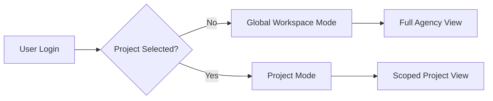

### Two Modes, One Workspace

| Mode | Scope | Sidebar | AI Context | Use Case |
|------|-------|---------|------------|----------|
| **Global** | All clients, projects, tasks | Full navigation | Organization-wide | Business health, forecasting |
| **Project** | Single project | Scoped navigation | Project-focused | Delivery, team coordination |

---

## Architecture

### System Architecture

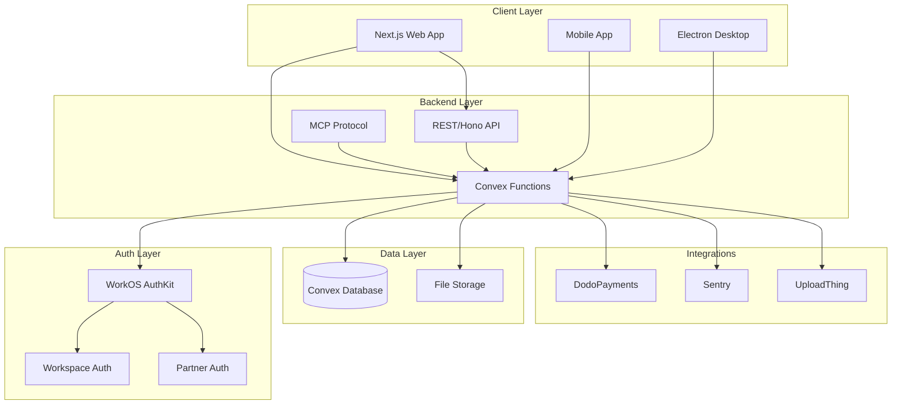

### Runtime Apps

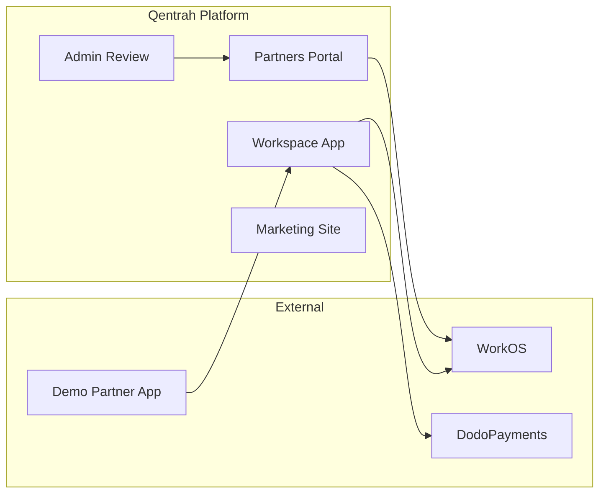

| App | Package | Purpose | Deployed |
|-----|---------|---------|----------|
| [Workspace](apps/workspace) | `@qentrah/workspace` | Main product runtime — organizations, projects, tasks, billing | Vercel |
| [Marketing](apps/marketing) | `@qentrah/marketing` | Public landing page, no private data | Vercel |
| [Mobile](apps/mobile) | `@qentrah/mobile` | React Native companion app | TBD |
| Partners | `@qentrah/partners` | Developer portal for partner app lifecycle | Vercel |
| Admin Review | `@qentrah/admin-review` | Internal operator console for submissions | Vercel |
| Demo Partner App | `@qentrah/demo-partner-app` | Reference external partner product | Vercel |

---

## Tech Stack

| Layer | Technology | Why |
|-------|-----------|-----|
| **Frontend** | [Next.js 16](https://nextjs.org) (Turbopack) | App Router, Server Components, Turbopack builds |
| **UI** | [Tailwind CSS 4](https://tailwindcss.com), [Radix UI](https://www.radix-ui.com), [Framer Motion](https://www.framer.com/motion/) | Utility-first styling, accessible primitives, animations |
| **Forms** | [React Hook Form](https://react-hook-form.com), [Zod](https://zod.dev) | Type-safe validation |
| **Backend** | [Convex](https://convex.dev) | Real-time database, serverless functions, reactive queries |
| **Auth** | [WorkOS AuthKit](https://workos.com/authkit) | SSO, organization management, partner API keys |
| **Payments** | [DodoPayments](https://dodopayments.com) | Per-user billing, subscriptions |
| **Monitoring** | [Sentry](https://sentry.io) | Error tracking, performance monitoring |
| **Storage** | [UploadThing](https://uploadthing.com) | File uploads, media management |
| **Runtime** | [Bun](https://bun.sh) | Fast package manager, script runner |
| **Language** | TypeScript 5 | End-to-end type safety |
| **Desktop** | [Electron](https://www.electronjs.org) | Native desktop app wrapper |

---

## Project Structure

```
qentrah/
├── apps/
│   ├── workspace/           # Main product (Next.js + Convex)
│   │   ├── src/
│   │   │   ├── app/         # Next.js App Router
│   │   │   │   └── [locale]/
│   │   │   │       ├── (app)/       # Main app routes
│   │   │   │       │   ├── billing/
│   │   │   │       │   ├── calendar/
│   │   │   │       │   ├── clients/
│   │   │   │       │   ├── dashboard/
│   │   │   │       │   ├── projects/
│   │   │   │       │   ├── settings/
│   │   │   │       │   └── tasks/
│   │   │   │       └── auth/        # Auth routes
│   │   │   ├── components/  # React components
│   │   │   ├── domains/     # Domain-specific modules
│   │   │   └── server/      # Server-side logic
│   │   ├── convex/          # Convex backend
│   │   │   ├── billing/     # Billing functions
│   │   │   ├── schema.ts    # Database schema
│   │   │   └── *.ts         # Server functions
│   │   └── electron/        # Desktop app
│   ├── marketing/           # Marketing site (Next.js)
│   └── mobile/              # Mobile app (React Native)
├── packages/
│   ├── ui/                  # Shared UI components
│   ├── auth/                # Auth logic
│   ├── auth-client/         # Client-side auth
│   ├── auth-sdk/            # Auth SDK
│   ├── authorization/       # Authorization rules
│   ├── base-logic/          # Base business logic
│   ├── brand-identity/      # Design tokens, brand assets
│   ├── compliance-logic/    # Compliance rules
│   ├── convex-adapters/     # Convex integration layer
│   ├── crm-logic/           # CRM business logic
│   ├── domain-contracts/    # Domain type contracts
│   ├── location-map/        # Location utilities
│   ├── market-logic/        # Marketplace logic
│   ├── offers-logic/        # Proposals/offers
│   ├── partner-auth-core/   # Partner auth core
│   ├── partner-workspace-sync/ # Partner sync
│   ├── platform-core/       # Platform core
│   ├── testing/             # Test utilities
│   ├── web-foundation/      # Web utilities
│   ├── workspace-logic/     # Workspace logic
│   └── ag-ui/               # AG UI components
├── scripts/                 # Build & utility scripts
├── docs/                    # Documentation
├── Brand/                   # Brand guidelines
├── CONTEXT.md               # Architecture context
├── PRODUCT_SPEC.md          # Product specification
├── package.json             # Root workspace config
├── vercel.json              # Vercel deployment config
└── bun.lock                 # Bun lockfile
```

---

## Core Domain Model

### Entity Relationship

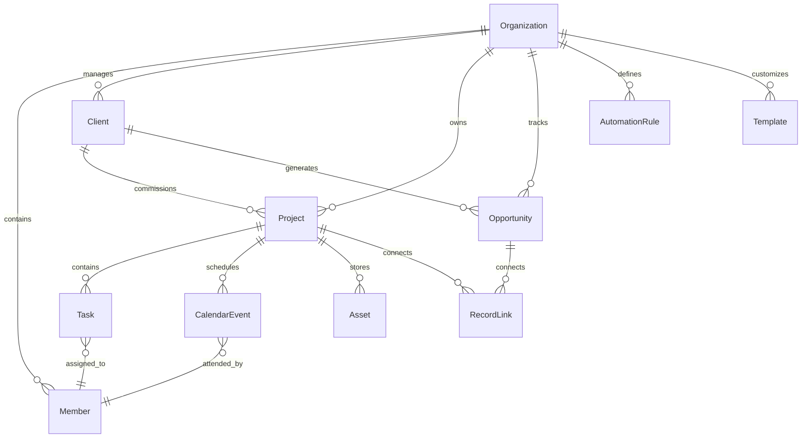

### Core Records

| Record | Description | Key Fields |
|--------|-------------|------------|
| **Client** | Customer or prospect | name, status, industry, contacts, tags |
| **Opportunity** | Sales deal in pipeline | title, value, stage, probability, close_date |
| **Project** | Active engagement | name, budget, timeline, team, health |
| **Task** | Work item | title, status, priority, assignee, due_date |
| **CalendarEvent** | Scheduled occurrence | title, type, date, attendees |
| **Asset** | File or deliverable | name, type, project, version |

### Workspace Templates

Templates apply presets to core records:

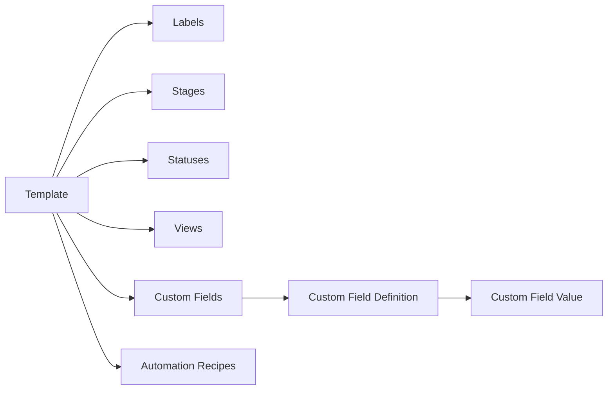

---

## Application Flows

### Partner App Lifecycle

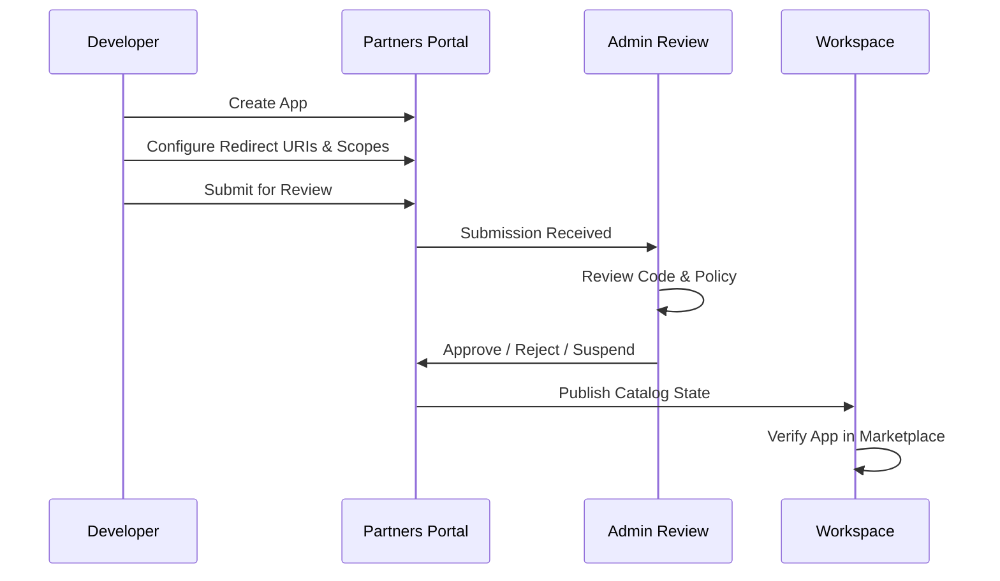

### Organization Authorization

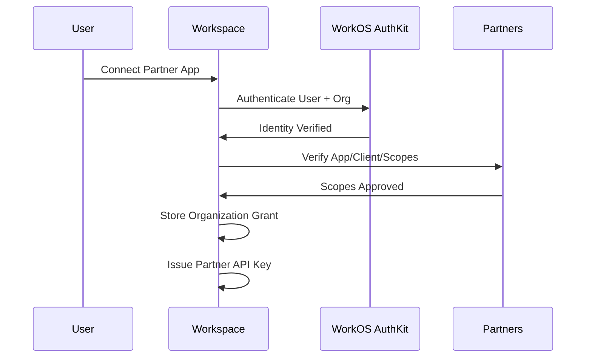

### Partner API Request Flow

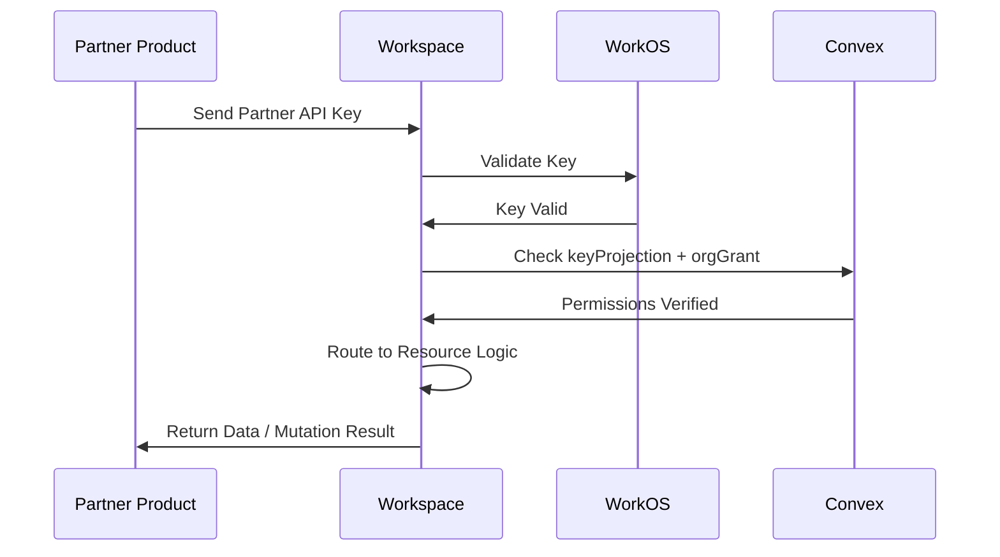

### Billing & Payments Flow

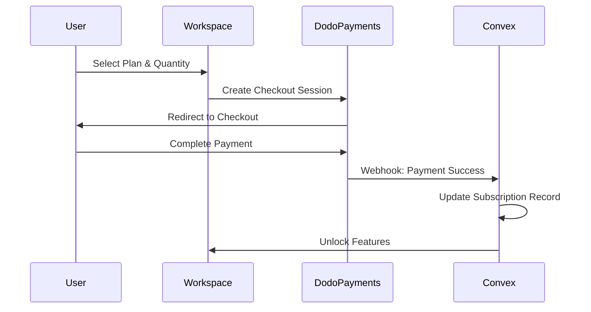

### Project Mode Activation

```mermaid
graph TD
    A[User Clicks Project] --> B[Project Switcher]
    B --> C[URL Updates]
    C --> D[/workspace/org/project/id]
    D --> E[Context Provider Emits ProjectScope]
    E --> F[Components Re-query Data]
    F --> G[Sidebar Labels Update]
    G --> H[Breadcrumbs Update]
    H --> I[AI Context Scoped]
    I --> J[Project Overview Loads]

    style A fill:#4f46e5,color:#fff
    style J fill:#10b981,color:#fff
```

### Task Lifecycle

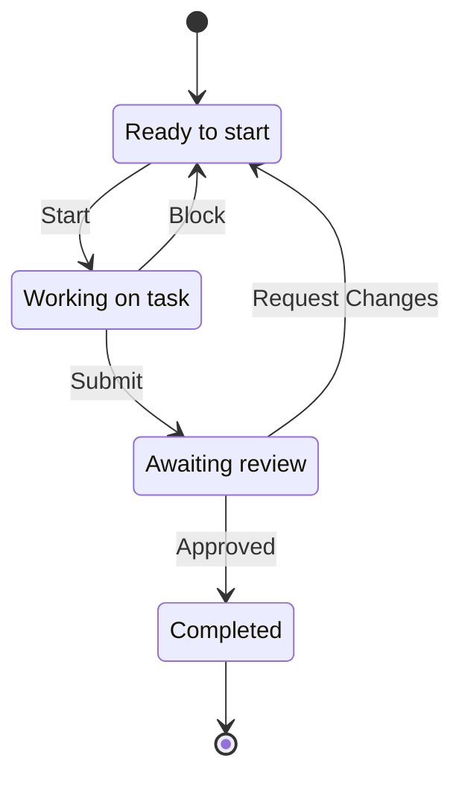

### Opportunity Pipeline

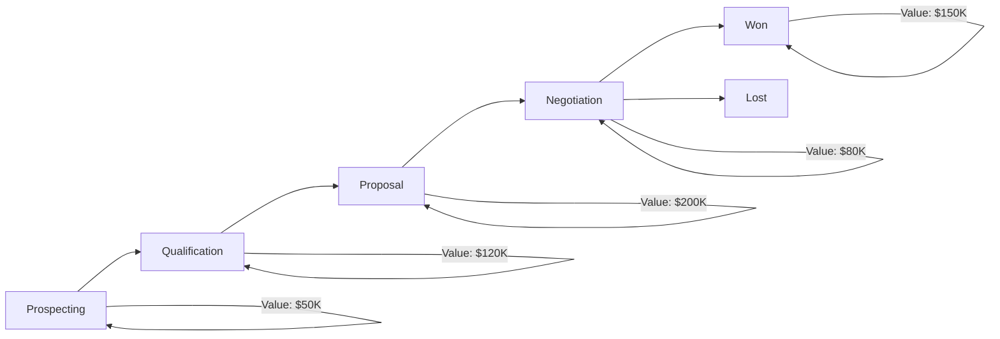

---

## Getting Started

### Prerequisites

| Tool | Version | Install |
|------|---------|---------|
| [Bun](https://bun.sh) | v1.3+ | `curl -fsSL https://bun.sh/install \| bash` |
| [Node.js](https://nodejs.org) | v18+ | [Download](https://nodejs.org) |
| [Git](https://git-scm.com) | Latest | [Download](https://git-scm.com) |

### Installation

```bash
# 1. Clone the repository
git clone https://github.com/Up-to-code/qentrah.git
cd qentrah

# 2. Install dependencies
bun install

# 3. Set up environment variables
cp .env.example .env.local
# Edit .env.local with your credentials

# 4. Start development
npm run dev:ws
```

### Environment Variables

Environment variables are managed through the **Convex dashboard**:

```bash
# Open Convex dashboard
npx convex dashboard

# Required for billing
DODO_PAYMENTS_API_KEY=your_api_key
DODO_PAYMENTS_ENVIRONMENT=test_mode
DODO_PAYMENTS_WEBHOOK_SECRET=your_webhook_secret
```

See [GETTING_STARTED.md](GETTING_STARTED.md) for detailed billing setup.

---

## Development

### Available Scripts

```bash
# Development
npm run dev:ws              # Start workspace app + Convex
npm run dev:marketing       # Start marketing site
npm run dev:partners        # Start partners portal
npm run dev:admin           # Start admin review app

# Build
npm run build               # Build all workspaces
npm run build:workspace:desktop  # Build desktop app

# Quality
npm run test                # Run all tests
npm run typecheck           # Typecheck all packages
npm run lint                # Lint all packages

# Brand
npm run brand:assets        # Generate brand assets
npm run brand:sync          # Sync brand across packages
```

### Monorepo Structure

This project uses **npm workspaces** for monorepo management:

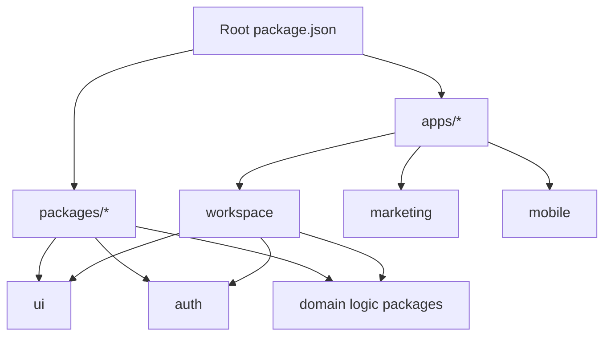

### Package Dependency Graph

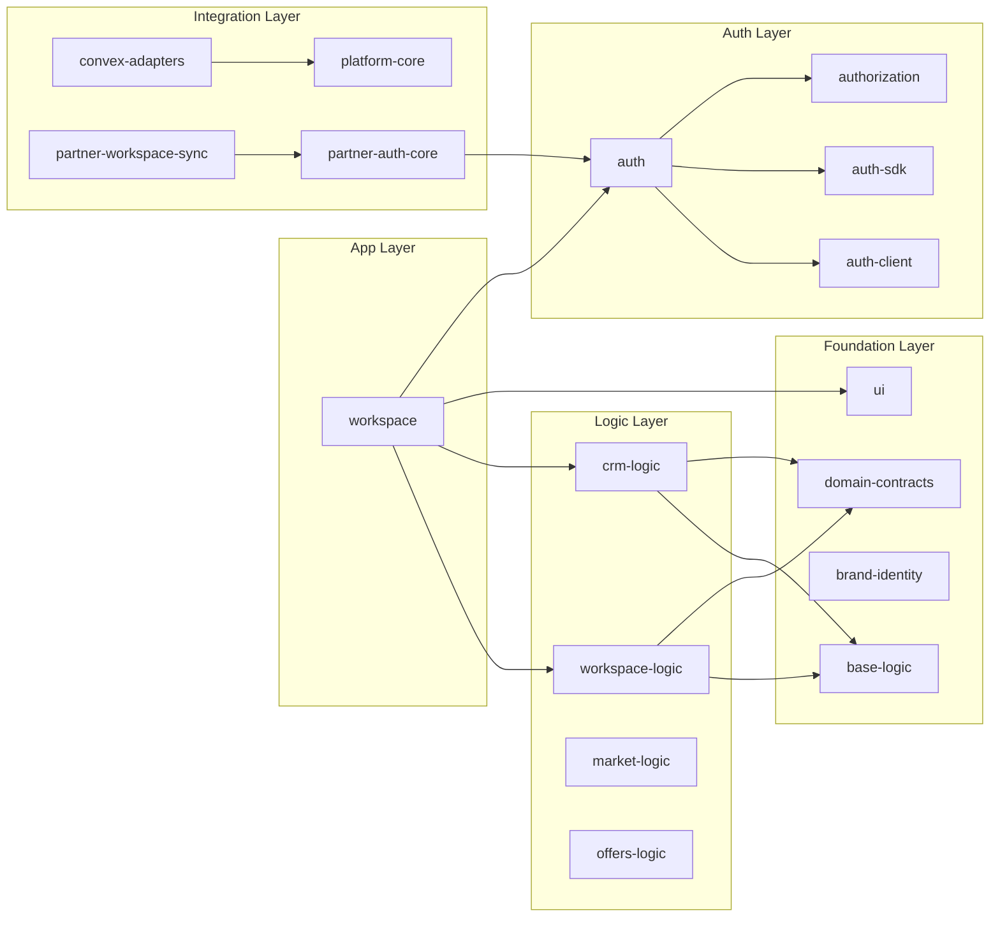

---

## Deployment

### Vercel Configuration

```json
{
  "framework": "nextjs",
  "installCommand": "bun install --frozen-lockfile",
  "buildCommand": "npm --workspace @qentrah/workspace run build",
  "ignoreCommand": "node scripts/vercel-ignore.mjs --workspace @qentrah/workspace"
}
```

### Deployment Flow

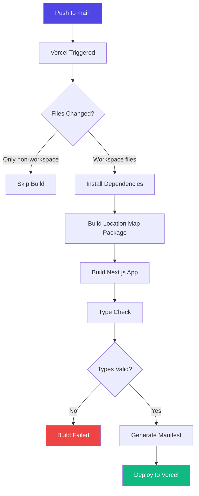

### Build Optimization

The `vercel-ignore.mjs` script skips builds when only non-workspace files change:

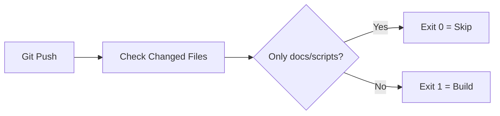

---

## Documentation

### Core Documents

| Document | Purpose | Link |
|----------|---------|------|
| **CONTEXT.md** | Architecture context & domain language | [Read](CONTEXT.md) |
| **PRODUCT_SPEC.md** | Full product specification (1166 lines) | [Read](PRODUCT_SPEC.md) |
| **GETTING_STARTED.md** | Phase 1 billing setup guide | [Read](GETTING_STARTED.md) |
| **BILLING_QUICK_REFERENCE.md** | Developer cheat sheet | [Read](BILLING_QUICK_REFERENCE.md) |

### Architecture Docs

| Document | Purpose | Link |
|----------|---------|------|
| **AGENTS.md** | AI agent instructions | [Read](AGENTS.md) |
| **CLAUDE.md** | Claude AI context | [Read](CLAUDE.md) |
| **BUILDER_GUIDE.md** | Builder implementation guide | [Read](BUILDER_GUIDE.md) |
| **SEO_CHECKLIST.md** | SEO requirements | [Read](SEO_CHECKLIST.md) |

### Decision Records

Architecture decisions are tracked in `docs/decisions/`:

```
docs/
├── decisions/           # ADR (Architecture Decision Records)
├── lifecycles/          # Workflow lifecycle docs
│   └── conversation-thread-list/
└── agents/              # Agent skill documentation
```

### Package Documentation

Each package has its own README:

| Package | README |
|---------|--------|
| `packages/ui` | [packages/ui/README.md](packages/ui/README.md) |
| `packages/auth` | [packages/auth/README.md](packages/auth/README.md) |
| `packages/workspace-logic` | [packages/workspace-logic/README.md](packages/workspace-logic/README.md) |
| `packages/crm-logic` | [packages/crm-logic/README.md](packages/crm-logic/README.md) |
| `packages/convex-adapters` | [packages/convex-adapters/README.md](packages/convex-adapters/README.md) |

---

## Key Features

### AI Integration

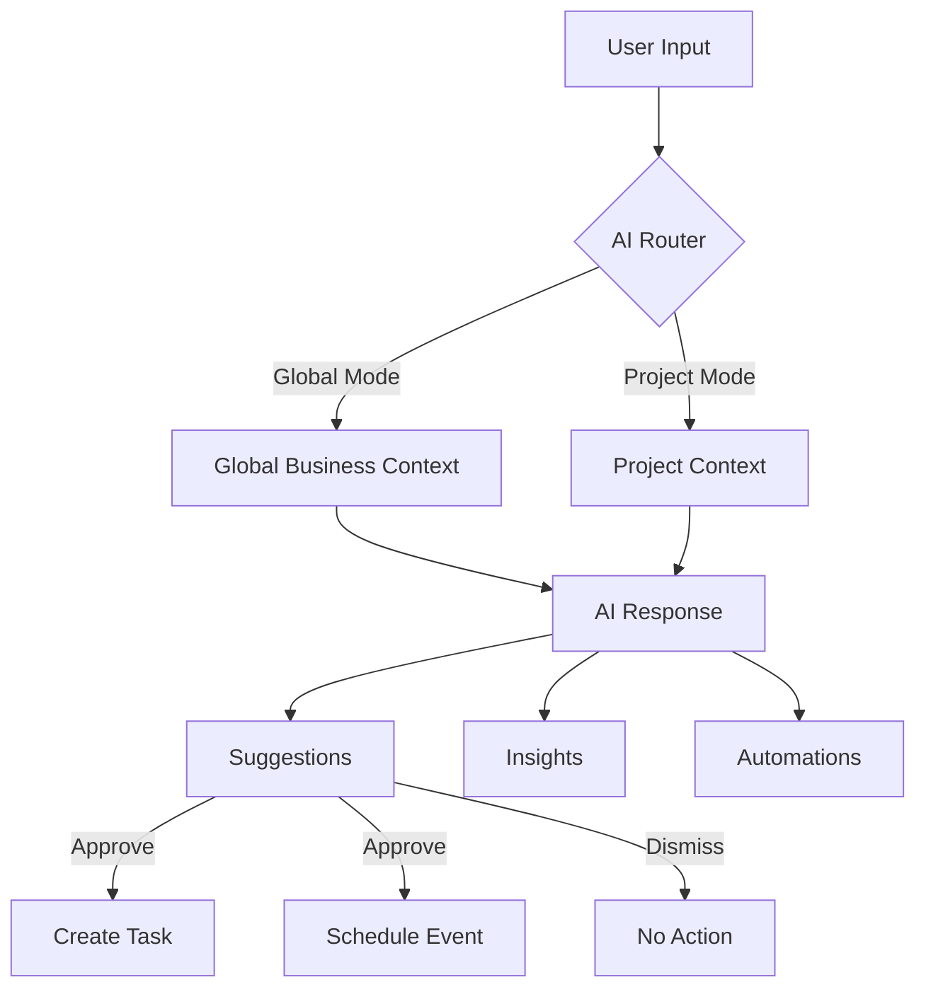

- **Global AI Chat**: Organization-wide recommendations, profitability analysis, team optimization
- **Project AI Chat**: Project-specific insights, risk detection, milestone tracking
- **AI Suggestions**: Auto-generate tasks, flag risks, suggest reassignments

### Custom Fields System

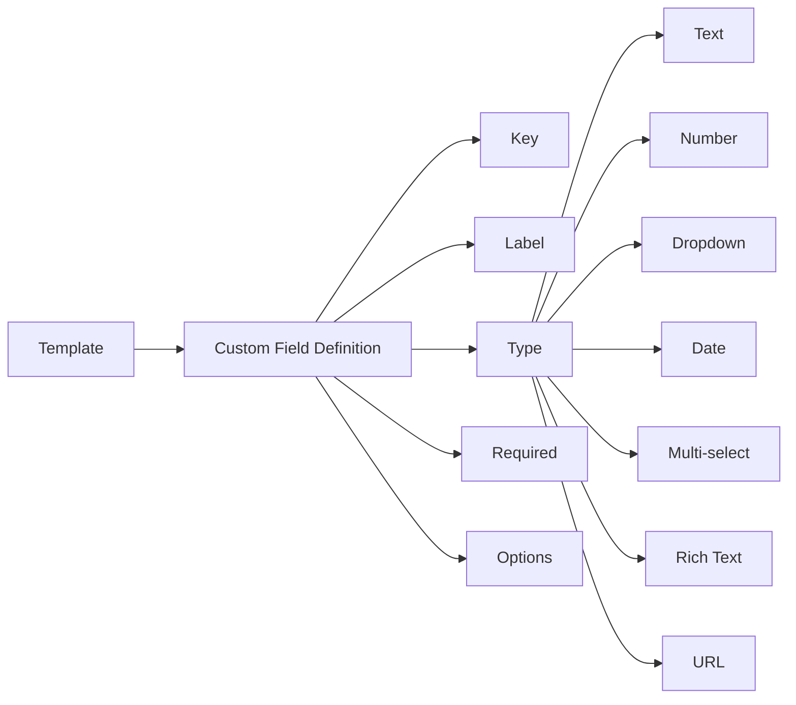

### Real-Time Updates

All data is reactive through Convex subscriptions:

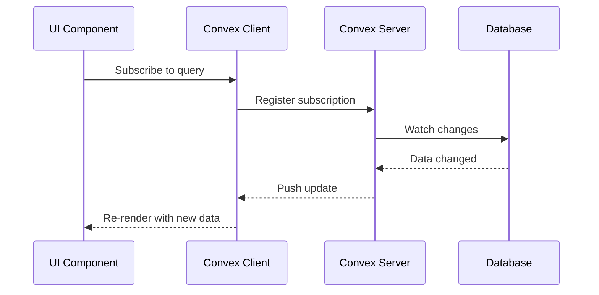

---

## Contributing

### Code Conventions

- **TypeScript**: Strict mode, no `any`
- **Components**: Functional components with hooks
- **Styling**: Tailwind CSS utility classes
- **State**: Convex queries/mutations + React hooks
- **Validation**: Zod schemas at API boundaries

### Commit Convention

```
feat: add new feature
fix: bug fix
docs: documentation only
style: code style changes
refactor: code refactoring
test: adding tests
chore: maintenance tasks
```

---

## License

Private & Proprietary — All rights reserved.

---

<div align="center">

**[Product Spec](PRODUCT_SPEC.md)** · **[Architecture](CONTEXT.md)** · **[Getting Started](GETTING_STARTED.md)** · **[Deployed App](https://qentrah.com)**

</div>
