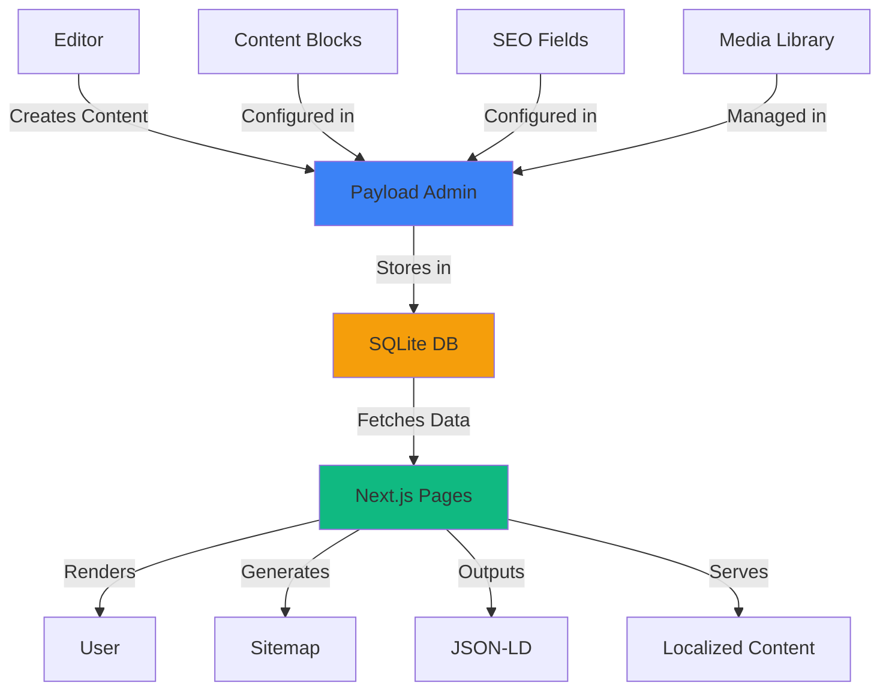
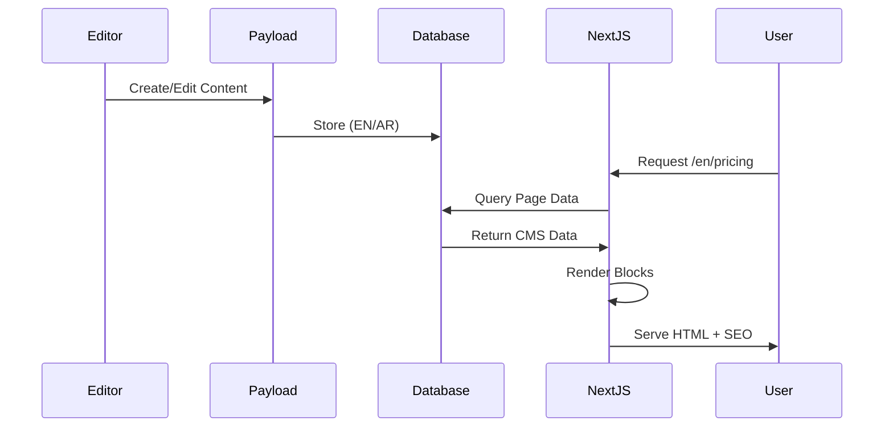
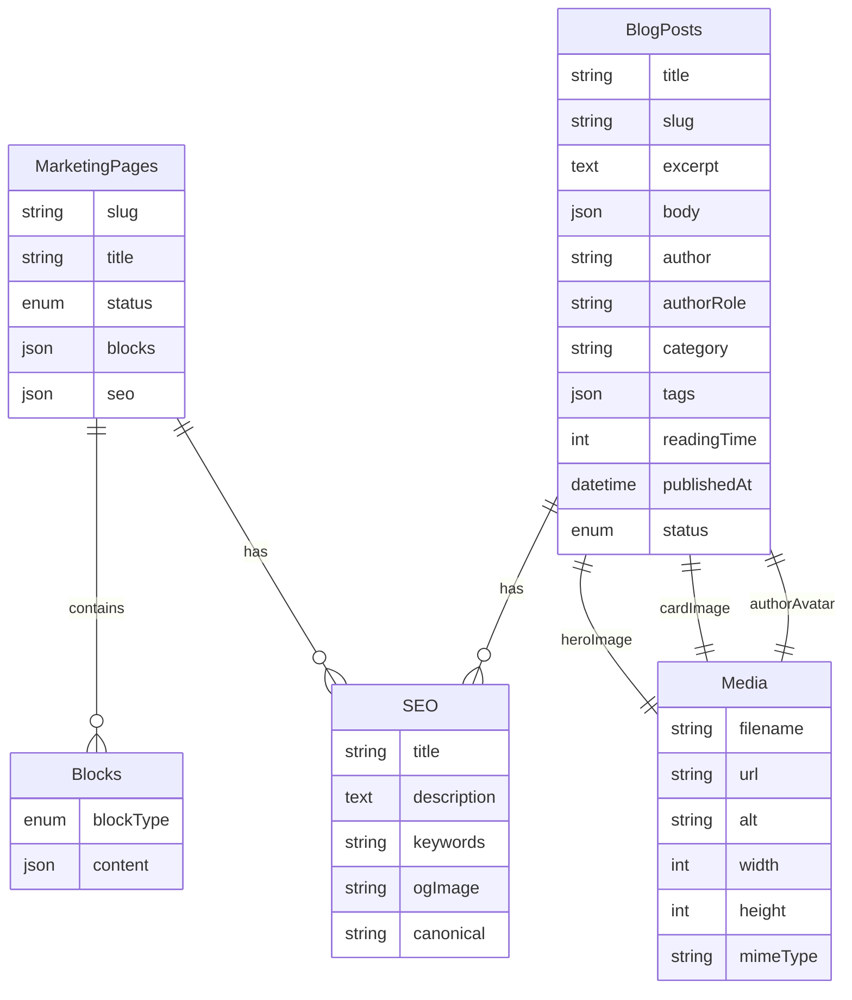
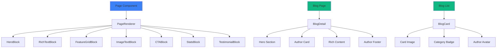
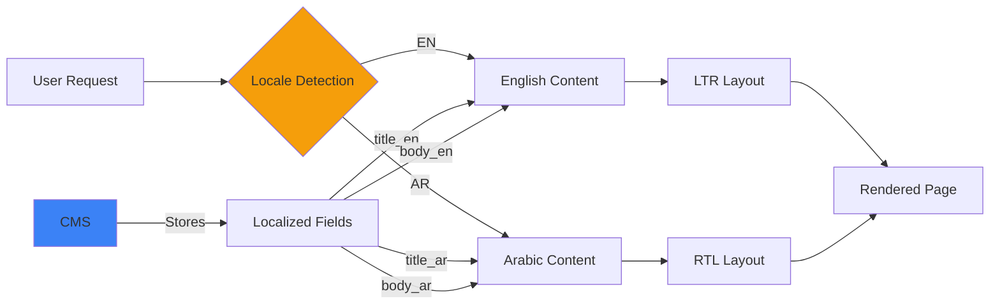
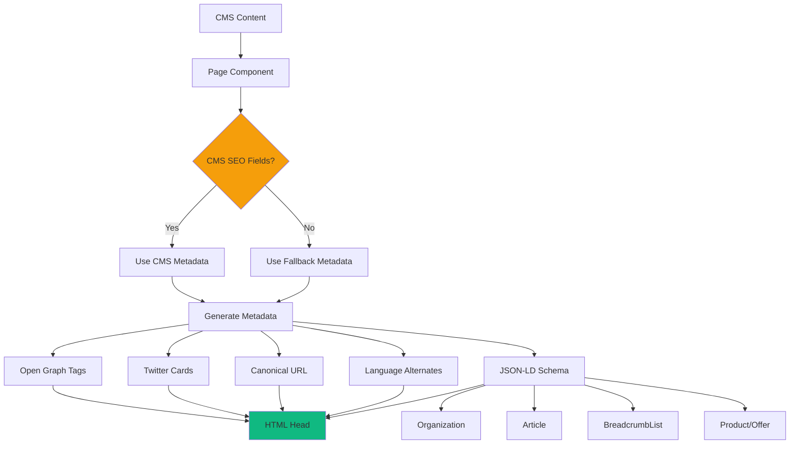
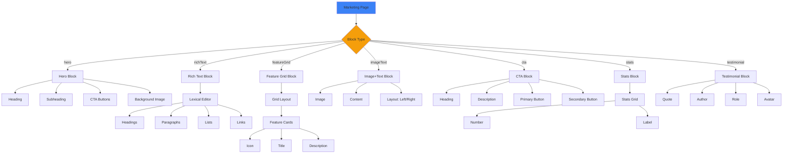
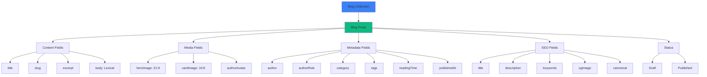
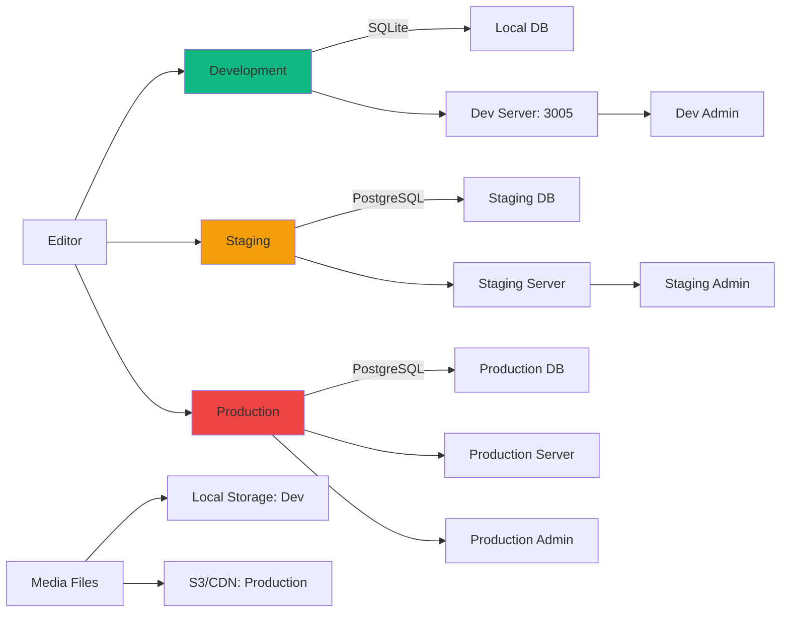

# Marketing CMS Architecture

## System Overview

## Content Flow

## Data Model

## Component Hierarchy

## Localization Architecture

## SEO & Metadata Flow

## Content Blocks System

## Blog Architecture

## File System Structure

```mermaid
graph TD
    A[apps/marketing/] --> B[lib/]
    A --> C[fields/]
    A --> D[blocks/]
    A --> E[collections/]
    A --> F[components/]
    A --> G[app/]
    A --> H[scripts/]
    
    B --> B1[locales.ts]
    B --> B2[workspace-links.ts]
    B --> B3[cms-pages.ts]
    B --> B4[cms-seo.ts]
    B --> B5[json-ld.ts]
    B --> B6[payload-api.ts]
    
    C --> C1[seoFields.ts]
    C --> C2[linkField.ts]
    
    D --> D1[Hero.ts]
    D --> D2[RichText.ts]
    D --> D3[FeatureGrid.ts]
    D --> D4[ImageText.ts]
    D --> D5[CTASection.ts]
    D --> D6[Stats.ts]
    D --> D7[Testimonial.ts]
    
    E --> E1[MarketingPages.ts]
    E --> E2[BlogPosts.ts]
    E --> E3[Media.ts]
    
    F --> F1[cms/]
    F --> F2[blog/]
    
    F1 --> F1A[page-renderer.tsx]
    F1 --> F1B[blocks/]
    
    F2 --> F2A[blog-card.tsx]
    F2 --> F2B[blog-detail.tsx]
    
    G --> G1[site/]
    G --> G2[payload/]
    
    G1 --> G1A[locale/]
    G1A --> G1A1[blog/]
    G1A --> G1A2[pricing/page-cms.tsx]
    G1A --> G1A3[about/page-cms.tsx]
    
    H --> H1[seed-cms.ts]
    
    style A fill:#3b82f6
```

## Deployment Architecture

## Access Patterns

### Content Editor Flow
1. Login to `/admin`
2. Select collection (Blog Posts / Marketing Pages)
3. Create/Edit content
4. Add media (images, PDFs)
5. Configure SEO fields
6. Switch locale (EN/AR)
7. Save draft or publish
8. Preview on frontend

### User Flow
1. Visit marketing page (e.g., `/en/pricing`)
2. Next.js fetches CMS data
3. PageRenderer selects block components
4. Blocks render with design system
5. SEO metadata injected in `<head>`
6. JSON-LD added to page
7. User sees localized, accessible content

### Developer Flow
1. Define new block in `blocks/`
2. Create renderer in `components/cms/blocks/`
3. Register in `PageRenderer`
4. Add to `MarketingPages` collection
5. Test in admin panel
6. Deploy to production

---

## Key Design Decisions

### 1. Hybrid CMS Approach
- **CMS controls**: Content, SEO, media
- **Code controls**: Design, layout, components
- **Why**: Maintains design quality while enabling content flexibility

### 2. Block-Based Architecture
- **Reusable blocks**: 7 block types
- **Flexible composition**: Mix and match on pages
- **Why**: Consistency without rigidity

### 3. Locale-First Design
- **Not hardcoded**: Extensible locale system
- **Per-field localization**: Each field can be translated
- **Why**: Easy to add new languages

### 4. SEO as First-Class Citizen
- **Per-page SEO**: Every page/post has SEO fields
- **Structured data**: JSON-LD for all content types
- **Why**: Maximize search visibility

### 5. Graceful Fallbacks
- **CMS unavailable**: Falls back to static content
- **Missing fields**: Uses sensible defaults
- **Why**: Resilient system

---

## Performance Considerations

### Build Time
- Static generation for published content
- Incremental Static Regeneration (ISR) for updates
- On-demand revalidation via webhooks

### Runtime
- Server-side rendering for dynamic content
- Client-side navigation (Next.js App Router)
- Image optimization via Next.js Image

### Database
- SQLite for development (file-based)
- PostgreSQL for production (scalable)
- Connection pooling for performance

### Caching
- Page-level caching via Next.js
- CDN caching for static assets
- Stale-while-revalidate pattern

---

This architecture provides a scalable, maintainable foundation for the Qentrah marketing site with full CMS capabilities.
