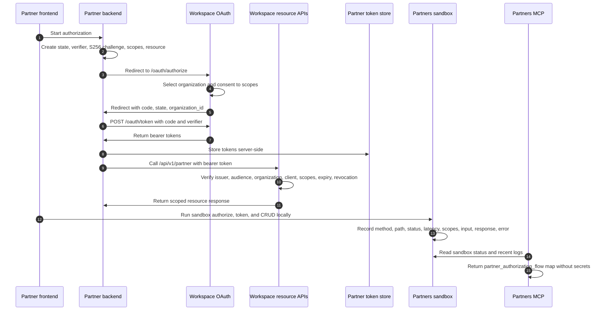

Use this page as the durable map for a Qentrah partner authorization integration. It follows the complete lifecycle from a partner frontend button to Workspace resource calls, sandbox evidence, MCP operator tools, and regression tests.

## OAuth 2.1 sequence



## System responsibility map

| System | Responsibility | Evidence |
| --- | --- | --- |
| Demo Partner App | Shows the requested scopes and OAuth 2.1 flow, starts authorization through its backend, stores tokens server-side, and calls Workspace resources with bearer tokens. | Dashboard, OAuth start route, callback route, session store, Workspace API client. |
| Partners Portal | Registers partner apps, shows single-topic detail tabs, exposes sandbox configuration, API explorer, request logs, implementation starter code, and this Flow map. | App detail tabs, docs pages, sandbox actions. |
| Workspace OAuth and resource server | Runs `/oauth/authorize`, organization consent, `/oauth/token`, and resource API enforcement for bearer token, audience, organization, client, scopes, expiry, and revocation. | Workspace OAuth routes, consent UI, partner resource access guard. |
| `@qentrah/auth-sdk` | Builds the canonical partner authorization code plus PKCE flow and server-side callback/token helpers. | Partner core helpers and tests. |
| `@qentrah/authorization` | Provides browser popup/redirect authorization UX, state validation, and user-facing error handling. | Browser client and authorization tests. |
| `@qentrah/partner-auth-core` | Normalizes partner access token claims and rejects legacy or incomplete claims before resource access. | Claim parser and package tests. |
| Partners Sandbox | Mirrors OAuth authorize/token, scoped CRUD, and request logs without creating Workspace registrations or production data. | Sandbox OAuth, API, resources, store, and logs tab. |
| Partners MCP | Lets approved local MCP links list apps, manage drafts, explain the lifecycle, and read sandbox status/log evidence with permission checks. | MCP transport, tools, permissions, tests. |

## Direct file inventory

| Phase | Purpose | Path |
| --- | --- | --- |
| Partner frontend | Demo dashboard, requested scopes, OAuth 2.1 flow panel, and start authorization CTA. | `apps/demo-partner-app/app/dashboard/page.tsx` |
| Partner backend | Demo OAuth start route that creates state, PKCE, scopes, resource audience, and redirects to Workspace. | `apps/demo-partner-app/app/api/auth/qentrah/start/route.ts` |
| Partner backend | Demo OAuth callback route that validates state, exchanges the code, and persists the organization connection. | `apps/demo-partner-app/app/api/auth/qentrah/callback/route.ts` |
| Partner backend | Demo OAuth helpers for configuration, PKCE, session, and Workspace API calls. | `apps/demo-partner-app/lib/oauth.ts` |
| Partner backend | Demo server-side organization session and token storage helpers. | `apps/demo-partner-app/lib/session.ts` |
| Partner backend | Demo Workspace resource API client that sends server-side bearer tokens. | `apps/demo-partner-app/lib/workspace-api.ts` |
| Partners UI | App detail tabs for configuration, OAuth, scopes, Flow, sandbox, API explorer, logs, and code. | `apps/partners/components/portal/AppDetailsTabs.tsx` |
| Partners docs | This lifecycle guide with sequence diagram, responsibility map, file inventory, and tests. | `apps/partners/content/docs/authorization-lifecycle.mdx` |
| Workspace OAuth | Public authorize endpoint that enters the Workspace OAuth lifecycle. | `apps/workspace/src/app/oauth/authorize/route.ts` |
| Workspace OAuth | Token endpoint that exchanges authorization codes and validates PKCE. | `apps/workspace/src/app/oauth/token/route.ts` |
| Workspace OAuth | Consent UI for organization authorization and requested scopes. | `apps/workspace/src/app/oauth/consent/consent-client.tsx` |
| Workspace resource server | Partner resource access guard for bearer token, audience, organization, client, scopes, expiration, and revocation checks. | `apps/workspace/src/server/domains/partnerApps/services/access-token.ts` |
| Shared package | `@qentrah/auth-sdk` partner authorize URL, PKCE, state, token exchange, refresh, and callback helpers. | `packages/auth-sdk/src/partner/core.ts` |
| Shared package | `@qentrah/authorization` browser popup and redirect authorization client. | `packages/authorization/src/client.ts` |
| Shared package | `@qentrah/partner-auth-core` canonical claim parsing and legacy claim rejection. | `packages/partner-auth-core/src/index.ts` |
| Sandbox OAuth | Sandbox authorize and token endpoints with login, PKCE S256, one-time codes, refresh, and sandbox tokens. | `apps/partners/server/sandbox/oauth.ts` |
| Sandbox API | Sandbox partner resource CRUD routes that validate scoped access and record request logs. | `apps/partners/server/sandbox/api.ts` |
| Sandbox storage | Sandbox organizations, OAuth codes, tokens, seeded resources, validation, writes, and request logs. | `apps/partners/server/sandbox/store.ts` |
| MCP | JSON-RPC initialize, tools/list, tools/call, authentication, usage logging, and error handling. | `apps/partners/server/mcp/transport.ts` |
| MCP | Partner MCP tool definitions and handlers, including authorization lifecycle and sandbox status. | `apps/partners/server/mcp/tools.ts` |

## MCP lifecycle tools

Use MCP only through a local endpoint supplied at runtime. Do not commit an MCP secret or paste one into docs, snapshots, or test output.

```bash
export PARTNER_MCP_TEST_URL="http://localhost:3002/api/mcp/partner/<public-id>/<redacted-secret>"
```

`partner_authorization_flow` returns the lifecycle phase map, documentation path, file inventory, sandbox evidence fields, and MCP secret policy.

`partner_sandbox_status` remains backward compatible by returning `sandbox`, and now also returns a top-level `logs` summary with recent method, path, status, latency, scopes, timestamp, request input summary, response summary, and error.

Live mutation testing must be opt-in:

```bash
export PARTNER_MCP_LIVE_MUTATIONS=1
```

## Sandbox lifecycle evidence

Sandbox OAuth mirrors the production shape:

- `/sandbox/oauth/authorize` requires a logged-in partner user, `response_type=code`, and `code_challenge_method=S256`.
- `/sandbox/oauth/token` exchanges one-time authorization codes plus the PKCE verifier and rejects reused or expired codes.
- `/api/v1/partner/organizations/:organizationId/*` validates bearer access, organization, resource, action, and scopes.
- Each sandbox resource request records method, path, status, latency, scopes, timestamp, request input, response summary, and error.

The Partners app detail `Logs` tab is the developer-facing evidence view. Logs appear after sandbox API requests from the API explorer or an external client.

## Test scenarios

| Area | Required coverage |
| --- | --- |
| `@qentrah/auth-sdk` | Authorize URL includes `response_type=code`, PKCE S256, resource, scopes, state, redirect URI, and organization handling. |
| `@qentrah/authorization` | Popup and redirect URL construction, state mismatch, and error message handling. |
| `@qentrah/partner-auth-core` | Canonical claims, `organization_id`, `azp` or `client_id`, partner scopes, and legacy claim rejection. |
| Workspace resources | Reject query bearer tokens, missing bearer tokens, wrong organization, wrong audience, missing scopes, expired connections, and revoked connections. |
| Partners sandbox | Sandbox authorize requires login and PKCE S256, token exchange rejects reused or expired codes, and CRUD writes create request logs. |
| MCP | Initialize, tools/list, `partner_authorization_flow`, permission denial, sandbox log summaries, and no client secret leakage. |
| Sandbox integration | Create sandbox, authorize, exchange code, call `me`, list clients, create client, update client, and verify logs. |
| Live MCP integration | Gated by `PARTNER_MCP_TEST_URL` and `PARTNER_MCP_LIVE_MUTATIONS=1`; create a unique disposable app, read/update it, read sandbox status/logs, submit, and delete cleanup. |
| E2E | Demo dashboard shows the OAuth 2.1 flow section, endpoints, scopes, and start authorization CTA. Partners app detail shows Flow, Sandbox, API explorer, and Logs tabs without overflow. |

## Developer checklist

- Browser code starts authorization through the partner backend only.
- Partner backend owns state, PKCE verifier, token exchange, refresh, and storage.
- Workspace owns organization consent and resource authorization.
- Tokens are sent in `Authorization: Bearer` headers only.
- Sandbox logs are used as the local proof of request shape and scope enforcement.
- MCP tools are permissioned and do not reveal OAuth client secrets or MCP secrets.
