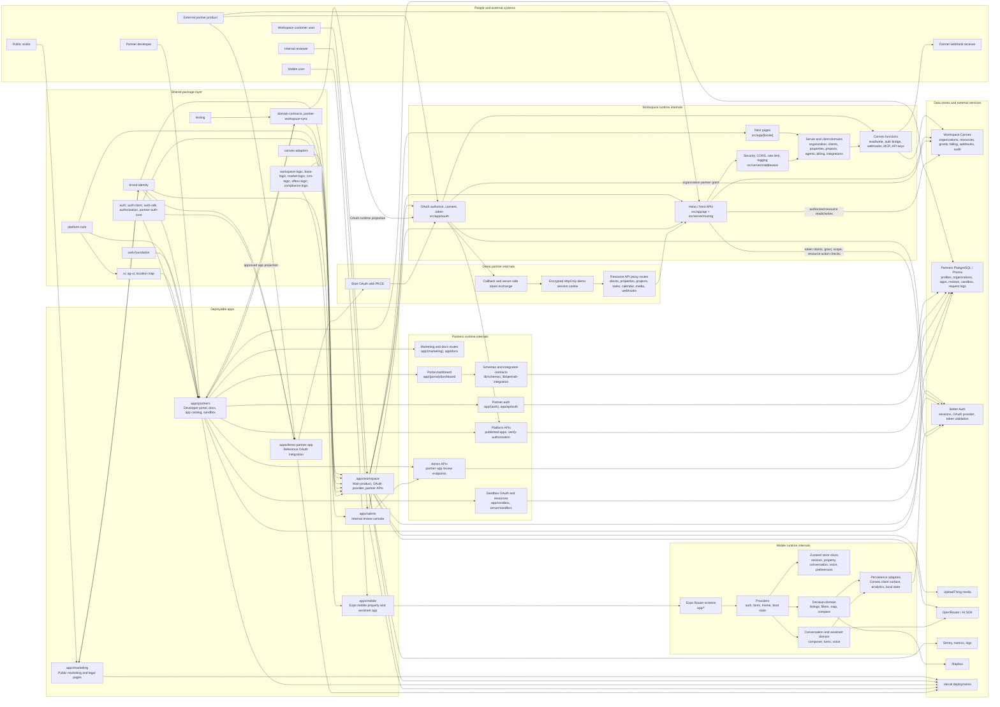

# All-In-One Repo Flow Chart

This is the single consolidated map for the repo. It puts the runtime apps,
external actors, data stores, shared packages, and the main product/partner
flows into one Mermaid chart.

## Reading The Chart

- Left side starts with users and external systems.
- Middle area is the deployable app layer.
- Runtime subgraphs show the main internal route/domain paths for Workspace,
  Partners, Demo, and Mobile.
- Right side shows owned data stores and third-party services.
- Bottom package layer shows the shared code imported across apps.
- The thickest business path is:
  `Partners app draft -> Admin review -> runtime projection -> Workspace OAuth -> organization grant -> partner resource API`.
