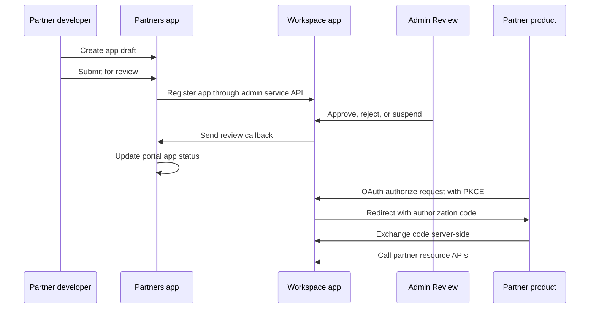

# Qentrah Architecture

Qentrah is an npm workspaces monorepo with separate deployable apps and shared
packages. The apps are independent runtime boundaries. Shared packages provide
contracts, UI, auth helpers, and pure domain logic.

## System Context

```txt
Partner product
  -> Demo Partner App or external partner backend
  -> Workspace OAuth authorize/token routes
  -> Workspace partner resource APIs

Partner developer
  -> Partners portal
  -> Partners app registration and submission
  -> Workspace admin partner app registration APIs
  -> Admin Review console
```

## Runtime Apps

Workspace is the product and platform authority. It owns organizations, members,
roles, OAuth consent, partner OAuth clients, partner resource APIs, upload
integration, AI runtime configuration, and the customer-facing app shell.

Partners is the developer portal. It owns partner developer accounts, app
drafts, submission flow, docs, sandbox OAuth endpoints, and the review callback
that mirrors Workspace decisions back into the portal.

Admin Review is an internal console. It reads pending partner app submissions
from Workspace service APIs and writes review decisions back to Workspace using
a service token.

Demo Partner App is a standalone reference partner. It proves the public
integration contract: start OAuth with PKCE, exchange the authorization code on
the server, store tokens server-side, and call Workspace resource APIs.

Marketing is a public content app. It is deployed separately and should not
depend on private Workspace or Partners runtime data.

## Data Ownership

| Data | Owner | Notes |
| --- | --- | --- |
| Organizations, members, roles | Workspace | Used by product, auth, permissions, consent |
| Partner OAuth clients and consent | Workspace | Source of truth for authorization and resource APIs |
| Partner developer accounts | Partners | Independent developer identity and organization records |
| Partner app drafts and submissions | Partners | Mirrored to Workspace during review submission |
| Review decisions | Workspace | Admin Review writes decisions through Workspace APIs |
| Demo OAuth session | Demo Partner App | Encrypted HttpOnly cookie only; not durable production storage |
| Public content | Marketing | Static/public app content |

## Partner App Lifecycle



## OAuth And Resource API Flow

1. The partner frontend renders an `Authorize with Qentrah` button.
2. The partner backend creates `state`, PKCE verifier, and PKCE challenge.
3. The user is redirected to `QENTRAH_WORKSPACE_API_URL/oauth/authorize`.
4. Workspace authenticates the user, asks for organization selection and
   consent when needed, and validates scopes.
5. Workspace redirects to the partner callback with an authorization code.
6. The partner backend exchanges the code at
   `QENTRAH_WORKSPACE_API_URL/oauth/token`.
7. The partner stores tokens server-side and calls
   `QENTRAH_WORKSPACE_API_URL/api/v1/partner/...`.

Access tokens, refresh tokens, client secrets, and service tokens must stay
server-side. Browser code should only see public URLs, public client IDs, and
non-sensitive state.

## Convex Boundaries

Workspace and Partners each have their own Convex deployment. They communicate
through explicit HTTP/API contracts and shared packages, not by importing each
other's generated Convex APIs.

Generated Convex folders such as `convex/_generated` are build artifacts. They
can be read for generated types while debugging, but they are not the source for
architecture decisions.

## Shared Packages

Packages under `packages/*` are the place for reusable logic, contracts, and UI
that must cross app boundaries. App-specific behavior should stay inside the app
unless another runtime genuinely needs it.

Use shared packages for:

- DTOs and schemas used by multiple apps.
- Pure domain logic that does not depend on app runtime state.
- UI primitives shared by more than one app.
- Auth and authorization utilities that encode platform contracts.

Avoid shared packages for:

- App-specific routing.
- Convex generated clients.
- Secret loading tied to one deployment.
- UI state that only one app uses.

## File Navigation

Important source locations:

| Path | Purpose |
| --- | --- |
| `apps/workspace/src/app` | Workspace App Router pages and route handlers |
| `apps/workspace/convex` | Workspace Convex schema, functions, and auth bridge |
| `apps/workspace/src/server` | Workspace server domains, middleware, protocols, validation |
| `apps/partners/app` | Partners App Router pages and API routes |
| `apps/partners/convex` | Partners data model and backend functions |
| `apps/partners/content/docs` | Partner-facing MDX docs |
| `apps/admin/app` | Admin Review pages |
| `apps/demo-partner-app/app` | Demo pages and route handlers |
| `packages/*` | Shared contracts, UI, auth, and pure domain logic |

Generated and dependency folders are intentionally excluded from architecture
maps: `.next`, `.source`, `node_modules`, and Convex `_generated`.
