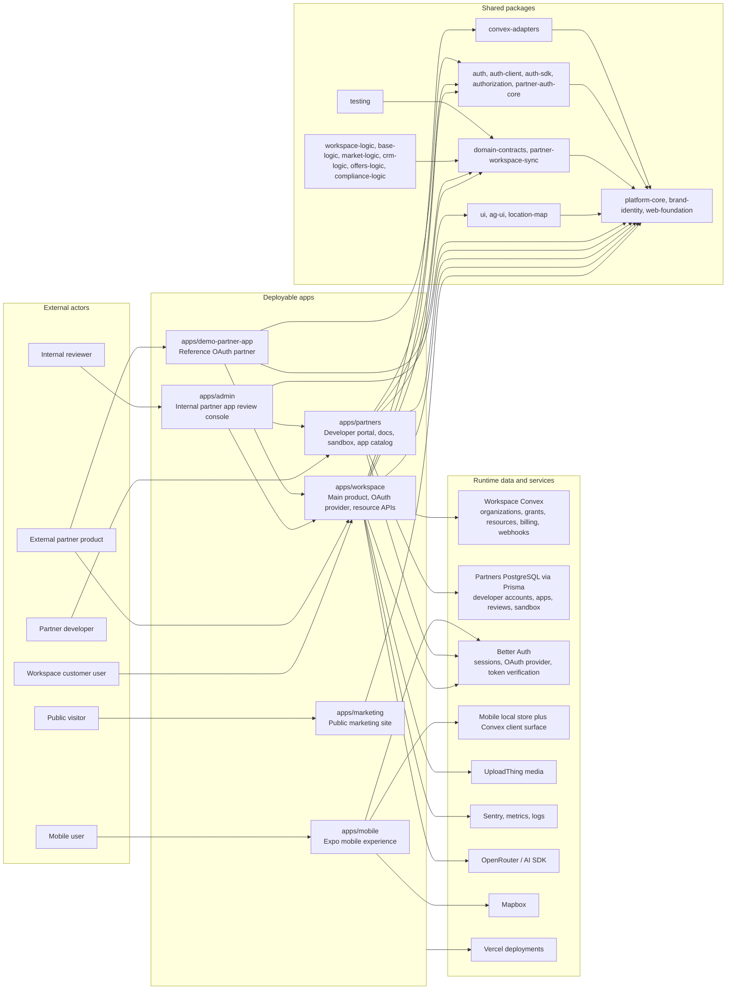
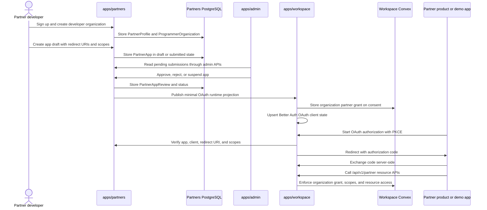
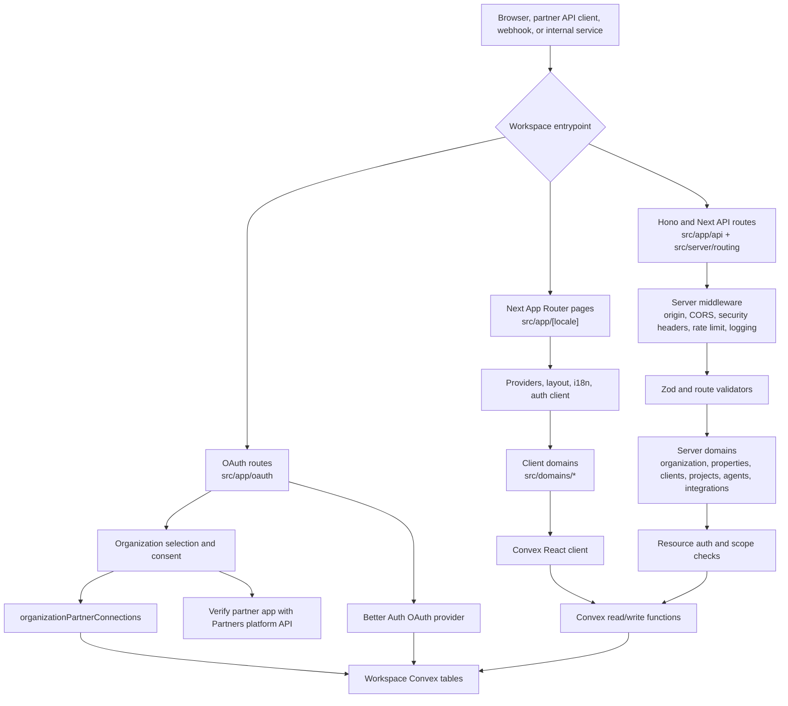
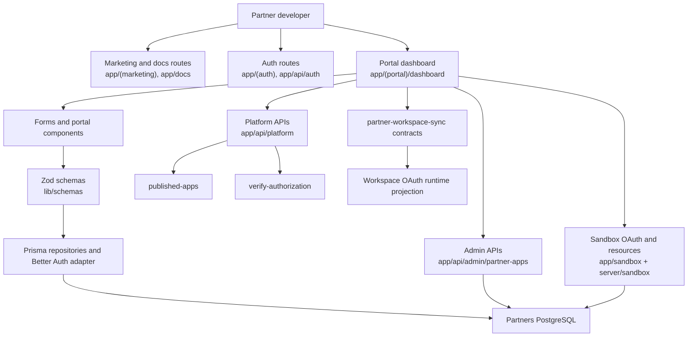
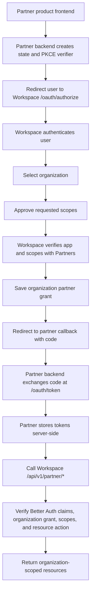
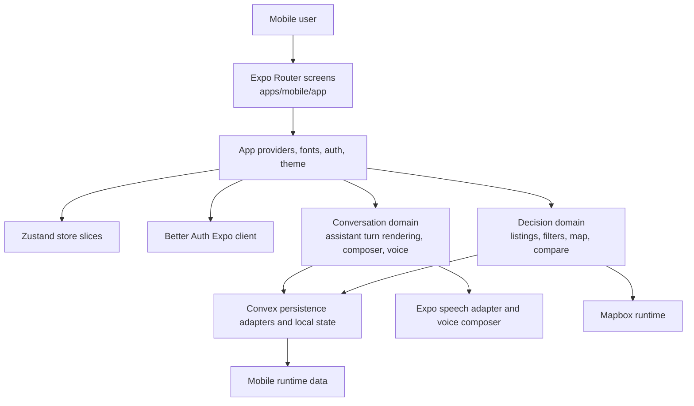
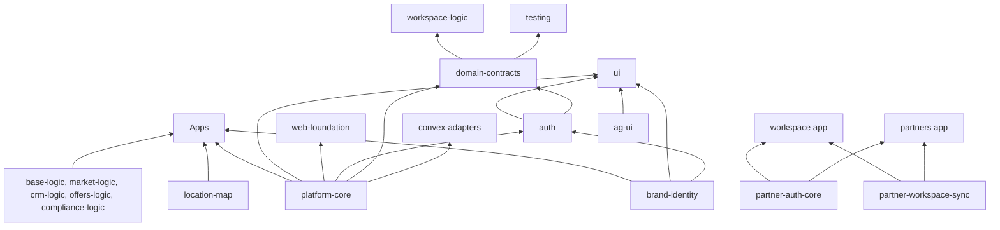
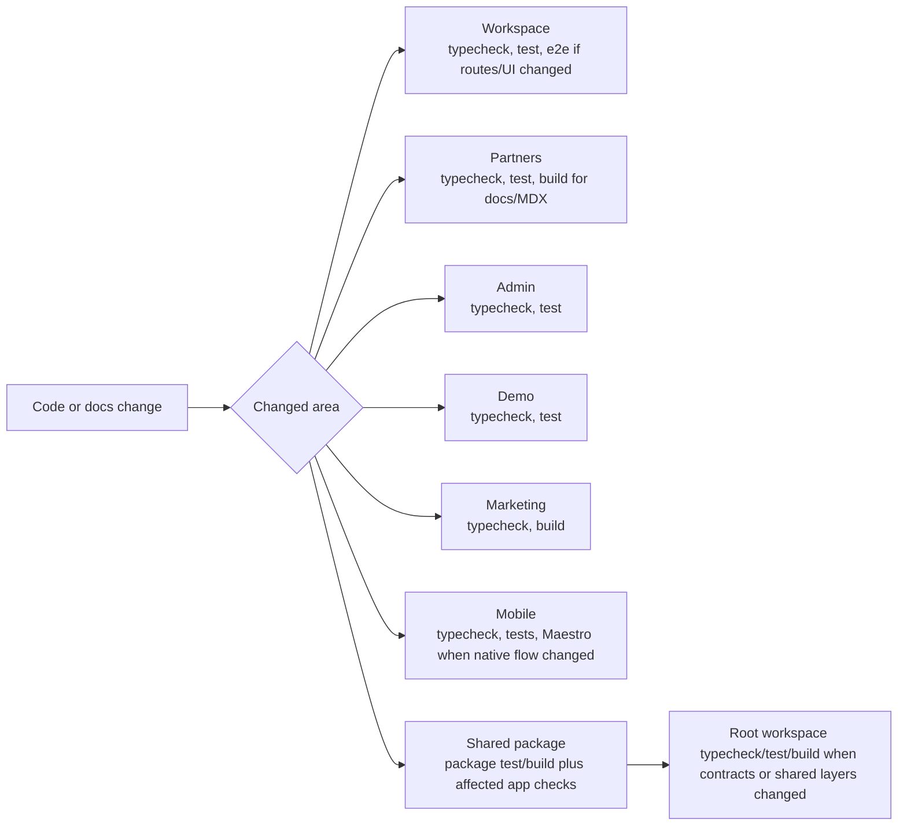

# Repo Flow Chart

This document maps the whole repository at a system-flow level. It complements
`docs/architecture/system-architecture.md` by showing how the deployable apps, shared packages,
data stores, and external actors move through Qentrah.

Generated folders and build outputs are intentionally excluded from this map:
`node_modules`, `.next`, `.source`, `dist`, `build`, `test-results`, and Convex
`_generated`.

## Whole Repo Runtime Map

## App Ownership

| App | Runtime role | Primary source paths | Primary data owner |
| --- | --- | --- | --- |
| Workspace | Customer product, OAuth provider, partner resource API, organization runtime | `apps/workspace/src/app`, `apps/workspace/src/server`, `apps/workspace/convex` | Workspace Convex and Better Auth runtime projection |
| Partners | Developer portal, app registration, docs, sandbox, app catalog | `apps/partners/app`, `apps/partners/server`, `apps/partners/prisma`, `apps/partners/content/docs` | Partners PostgreSQL via Prisma |
| Admin Review | Internal app submission review console | `apps/admin/src/app`, `apps/admin/src/lib` | Partners review APIs, with Workspace service calls where needed |
| Demo Partner App | Reference external partner implementation | `apps/demo-partner-app/app`, `apps/demo-partner-app/lib` | Demo session cookie and Workspace resource API calls |
| Marketing | Public content site | `apps/marketing/app`, `apps/marketing/components`, `apps/marketing/lib` | Static/public content only |
| Mobile | Expo mobile surface for property, conversation, voice, and preferences | `apps/mobile/app`, `apps/mobile/src` | Local Zustand state, mobile persistence adapters, Convex client surface |

## Partner Platform Flow

The source of truth stays split on purpose:

- Partners owns app catalog, developer accounts, redirect URIs, scopes, review
  state, published catalog status, and sandbox data.
- Workspace owns organization grants, OAuth enforcement, product resources,
  resource API authorization, webhooks, billing, media, and customer runtime
  state.
- Admin Review is an operator console over service APIs. It does not own the
  review data model.

## Workspace Request Flow

Key Workspace source areas:

- `apps/workspace/src/app/oauth`: OAuth authorize, consent, organization
  selection, and token routes.
- `apps/workspace/src/app/api`: API route entrypoints.
- `apps/workspace/src/server`: middleware, route adapters, security,
  validation, observability, and domain services.
- `apps/workspace/convex`: schema, auth bridge, resource functions, grants,
  billing, webhooks, agents, and MCP/API-key state.

## Partners Request Flow

Important Partners boundaries:

- `apps/partners/prisma/schema.prisma` owns developer profiles,
  organizations, app drafts, reviews, sandbox organizations, sandbox OAuth
  codes/tokens, request logs, and workspace links.
- `apps/partners/app/api/platform/*` exposes catalog and authorization checks
  to Workspace.
- `apps/partners/lib/qentrah-integration` keeps the Workspace integration
  contract for partner-facing flows.
- `packages/partner-workspace-sync` owns the minimal projection contract used
  between Partners and Workspace.

## External Partner OAuth Flow

The demo app implements this flow in:

- `apps/demo-partner-app/app/api/auth/qentrah/start/route.ts`
- `apps/demo-partner-app/app/api/auth/qentrah/callback/route.ts`
- `apps/demo-partner-app/app/api/qentrah/*`
- `apps/demo-partner-app/lib/oauth.ts`
- `apps/demo-partner-app/lib/workspace-api.ts`

## Mobile Flow

Mobile is not listed in the root README app table, but it is present as the
`@zane-ai/mobile` workspace. Treat it as a separate Expo runtime boundary.

## Shared Package Layers

Package placement rules:

- Put cross-app schemas and DTOs in `packages/domain-contracts`.
- Put OAuth and partner authorization primitives in `packages/auth`,
  `packages/auth-client`, `packages/auth-sdk`, `packages/authorization`, or
  `packages/partner-auth-core`.
- Put Workspace and Partners projection contracts in
  `packages/partner-workspace-sync`.
- Put reusable UI in `packages/ui`, `packages/ag-ui`, or
  `packages/location-map`.
- Put app-only routing, secret loading, generated Convex APIs, and one-runtime
  UI state inside the owning app.

## Operational Validation Flow

Use the narrowest validation first, then broaden when shared contracts, auth,
routing, data models, or cross-app flows changed.

## Fast Navigation Index

| Need | Start here |
| --- | --- |
| Product and organization runtime | `apps/workspace/src/app/[locale]/(app)`, `apps/workspace/src/domains` |
| OAuth provider behavior | `apps/workspace/src/app/oauth`, `apps/workspace/src/server/auth` |
| Partner resource APIs | `apps/workspace/src/server/routing/v1`, `apps/workspace/src/server/domains` |
| Workspace data model | `apps/workspace/convex/schema.ts`, `apps/workspace/convex/*` |
| Partner portal dashboard | `apps/partners/app/(portal)/dashboard`, `apps/partners/components/portal` |
| Partner app catalog and review state | `apps/partners/prisma/schema.prisma`, `apps/partners/app/api/platform`, `apps/partners/app/api/admin` |
| Partner docs | `apps/partners/content/docs`, `apps/partners/components/docs` |
| Admin review console | `apps/admin/src/app`, `apps/admin/src/lib` |
| External integration example | `apps/demo-partner-app/app/api/auth/qentrah`, `apps/demo-partner-app/app/api/qentrah` |
| Mobile screens and state | `apps/mobile/app`, `apps/mobile/src/store`, `apps/mobile/src/conversation`, `apps/mobile/src/decision` |
| Public marketing | `apps/marketing/app`, `apps/marketing/components/marketing` |
| Shared contracts | `packages/domain-contracts`, `packages/partner-workspace-sync` |
| Shared auth | `packages/auth`, `packages/auth-client`, `packages/auth-sdk`, `packages/authorization`, `packages/partner-auth-core` |
| Shared UI | `packages/ui`, `packages/ag-ui`, `packages/location-map`, `packages/brand-identity` |
