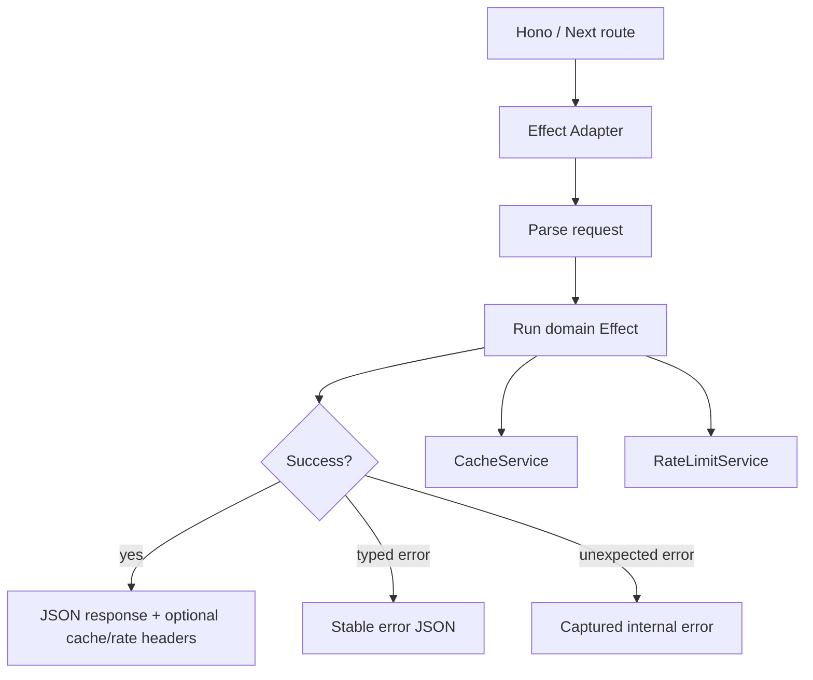

# Flow

## Current Flow Before This Pass

1. Hono or Next route receives a request.
2. Each handler manually parses JSON, validates with Zod, and returns an inline `Response` on failure.
3. Each handler wraps service calls in local `try/catch`.
4. Workspace maps unknown errors through message regexes.
5. Partners signup/signin use an app-local `Map` rate limiter.
6. Workspace cache folders exist as readiness placeholders, but no shared cache Interface is active.

## Target Flow

1. Hono or Next route receives a request.
2. The edge handler calls a small Adapter (`runEffectRoute` for Hono, direct shared helpers for Next).
3. The Adapter parses input once, runs an Effect program, and maps typed errors to stable JSON.
4. Shared cache policy uses scoped keys and explicit TTLs for safe read-through caching.
5. Shared rate-limit policy returns `allowed`, `remaining`, `resetAt`, and `retryAfterMs`; callers set standard HTTP headers.
6. Domain services can gradually move from Promise/throw behavior to Effect/typed-error behavior without changing routers.

