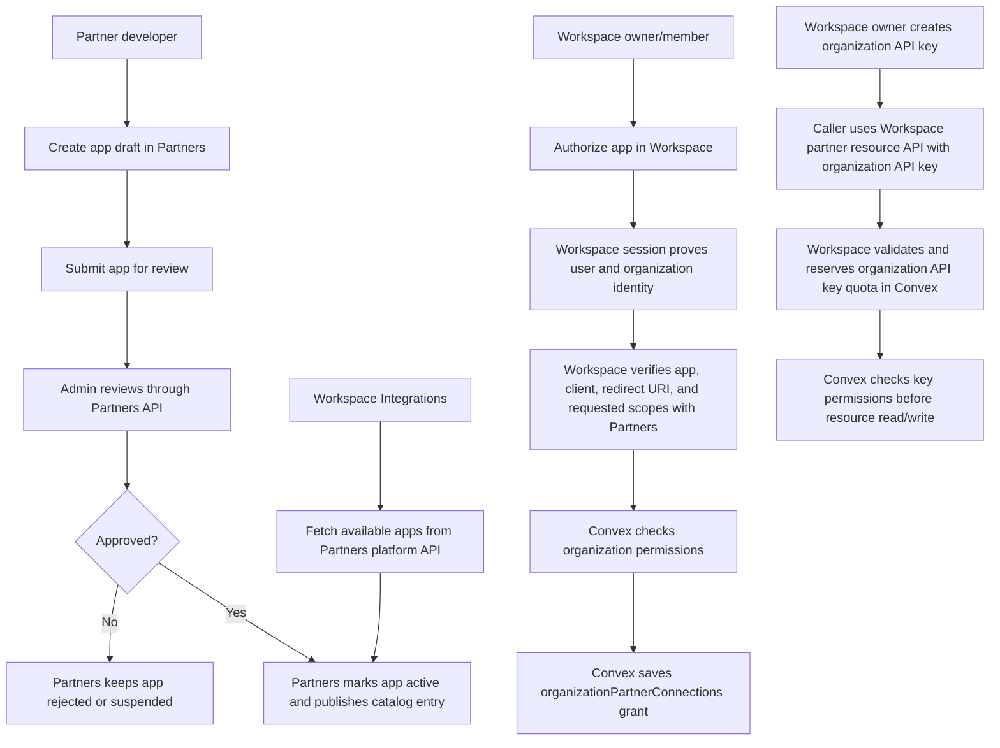

# Flow

## Current Flow

1. Partners app catalog stores app status, client id, redirect URIs, and maximum allowed scopes.
2. Admin reviews through Partners APIs; Workspace does not review or persist the catalog.
3. Workspace integrations fetch active apps from Partners platform APIs.
   - Partners caches published catalog responses briefly because catalog metadata is global/safe and the Workspace UI can request it repeatedly during navigation.
   - Cache keys include pagination and `updatedSince`, so callers still get distinct pages and incremental refreshes.
4. A Workspace owner/member authorizes a partner app from Workspace.
5. Workspace session state proves user identity and selected organization before the Workspace handler can mutate grants.
6. Workspace verifies app/client/redirect/scopes with Partners and checks `oauthApp:authorize` plus each requested resource permission through Convex `assertOrganizationResourcePermission`.
7. Convex stores the organization grant in `organizationPartnerConnections` with only the requested and verified scopes.
8. Workspace organization API keys are created through organization settings and store only key metadata plus local resource/action permissions.
9. Partner resource APIs validate the bearer key through Convex, reserve quota, and check local key permissions before reading or mutating data.
10. Workspace organization API keys audit as `apiKey` actors and cannot call inbound partner webhook endpoints or enqueue partner-app outbound webhooks.
11. Legacy Better Auth/OAuth bearer tokens are rejected with `410`.

## Dependencies

- Partner app max scopes must be checked before saving a Workspace grant.
- Saved grant scopes must be the user-approved requested scopes, not the app maximum.
- Organization API key permissions must be checked on every resource request.
- Strict schema deployment requires old `partnerAppId` and `oauthClientId` records to be migrated first.
- Workspace may keep legacy OAuth sync endpoints as transition shims, but they must not grant data access or become a catalog/review source of truth.
