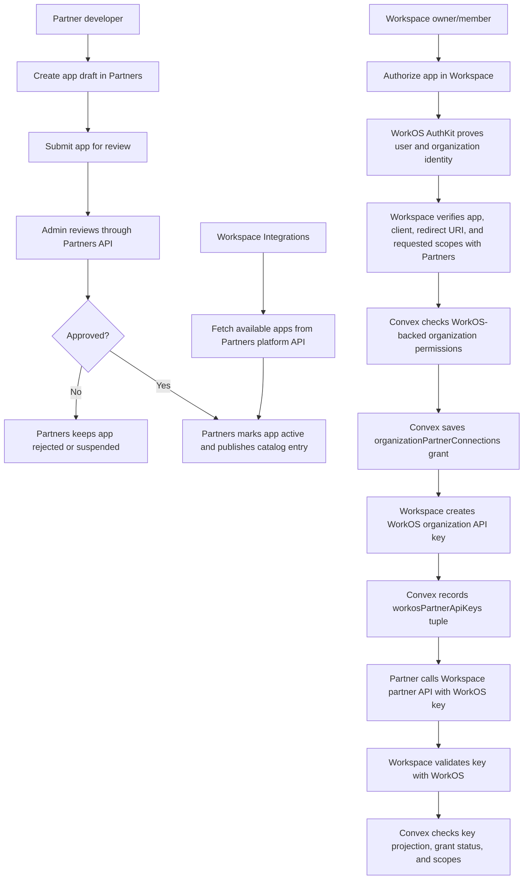

# Flow

## Current Flow

1. Partners app catalog stores app status, client id, redirect URIs, and maximum allowed scopes.
2. Admin reviews through Partners APIs; Workspace does not review or persist the catalog.
3. Workspace integrations fetch active apps from Partners platform APIs.
   - Partners caches published catalog responses briefly because catalog metadata is global/safe and the Workspace UI can request it repeatedly during navigation.
   - Cache keys include pagination and `updatedSince`, so callers still get distinct pages and incremental refreshes.
4. A Workspace owner/member authorizes a partner app from Workspace.
5. WorkOS AuthKit proves user identity and selected organization before the Workspace handler can mutate grants.
6. Workspace verifies app/client/redirect/scopes with Partners and checks `oauthApp:authorize` plus each requested resource permission through Convex `assertOrganizationResourcePermission`.
7. Convex stores the organization grant in `organizationPartnerConnections` with only the requested and verified scopes.
8. Workspace issues a WorkOS organization API key only for an active grant and requested key permissions that are a subset of approved scopes.
9. Convex records the key projection in `workosPartnerApiKeys`, including WorkOS API key id, WorkOS owner organization id, partner id, Partners client id, connection id, permissions, status, and expiry.
10. Partner resource APIs validate the bearer key with WorkOS, then validate the Convex key projection and active organization grant before reading or mutating data.
11. Partner-key writes are audited as `partnerApp` actors and can enqueue outbound partner webhooks. Workspace organization API keys remain separate `apiKey` actors and cannot call inbound partner webhook endpoints.
12. Legacy Better Auth/OAuth bearer tokens are rejected with `410`; partners must use WorkOS partner API keys.

## Dependencies

- Partner app max scopes must be checked before saving a Workspace grant.
- Saved grant scopes must be the user-approved requested scopes, not the app maximum.
- WorkOS key permissions must be a subset of the saved organization grant scopes.
- Resource APIs must validate both WorkOS key state and Convex grant state on every request.
- Strict schema deployment requires old `partnerAppId` and `oauthClientId` records to be migrated first.
- Workspace may keep legacy OAuth sync endpoints as transition shims, but they must not grant data access or become a catalog/review source of truth.
