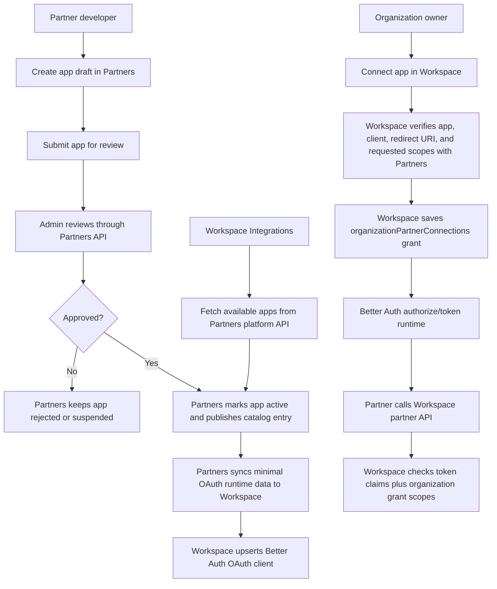

# Flow

## Current Flow

1. Partners app catalog stores app status, client id, redirect URIs, and maximum allowed scopes.
2. Admin reviews through Partners APIs; Workspace does not review or persist the catalog.
3. Partners syncs only minimal OAuth runtime state to Workspace so Better Auth can enable/disable the OAuth client.
   - The shared `OAuthRuntimeProjectionInput` contract owns the payload shape.
   - Partners keeps the HTTP Adapter that signs/sends the projection.
   - Workspace keeps the Better Auth Adapter that applies the projection.
4. Workspace integrations fetch active apps from Partners platform APIs.
5. Partner starts OAuth authorization against Workspace `/oauth/authorize`.
6. Better Auth handles authorization-code and PKCE protocol behavior.
7. Workspace consent verifies app/client/scopes with Partners and records the organization grant for requested resource scopes.
8. Better Auth consent completes and issues tokens.
9. Workspace custom token claims include canonical `organization_id` and partner scopes for organization-bound grants.
10. Partner resource APIs call the `authorizePartnerResourceRequest` Interface, which verifies the bearer token with Better Auth, parses canonical claims, then validates against `organizationPartnerConnections`.
11. Workspace integrations UI consumes a view-model Module that merges live Partners catalog data with local organization grants.

## Dependencies

- Partner app max scopes must be checked before saving a Workspace grant.
- Saved grant scopes must be the user-approved requested scopes, not the app maximum.
- Resource APIs must reject tokens without canonical `organization_id` or OAuth client id.
- Strict schema deployment requires old `partnerAppId` and `oauthClientId` records to be migrated first.
- Workspace may project approved app state into Better Auth OAuth clients, but that projection must not become a catalog or review source of truth.
