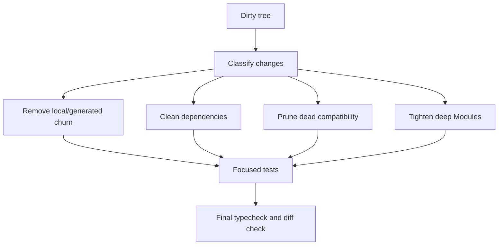

# Flow

## Cleanup Flow

1. Inventory dirty files and classify each change.
2. Remove local/generated churn first.
3. Normalize package manifests and regenerate lockfile.
4. Clean shallow Modules and duplicate Adapters only where tests cover the Interface.
5. Preserve source-of-truth decisions from ADRs.
6. Run focused tests per bucket, then final typecheck and `git diff --check`.

