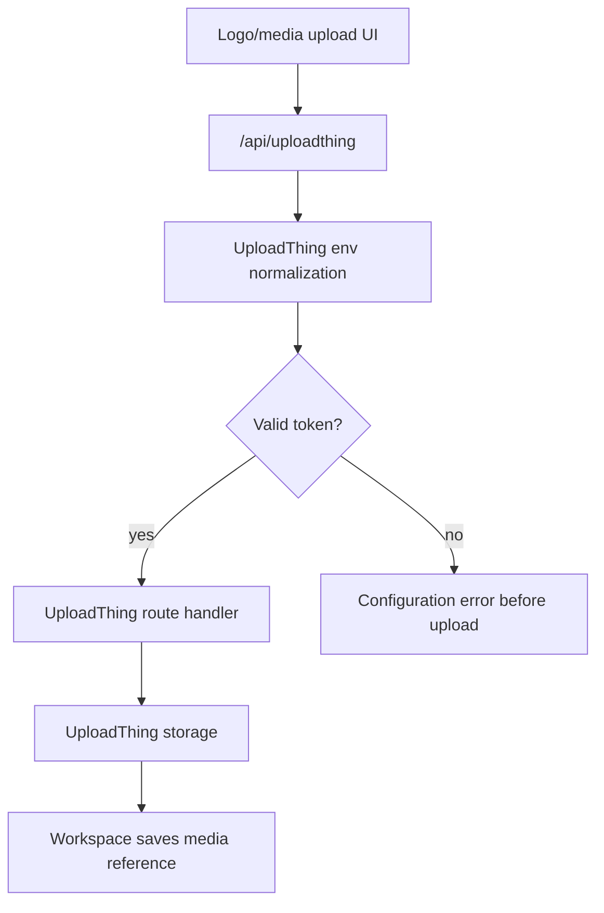

# Flow

## Current Flow

1. User selects/crops an organization logo in Workspace.
2. Browser calls UploadThing client at `/api/uploadthing`.
3. Workspace route handler authenticates the user and checks organization permissions.
4. UploadThing server runtime reads `UPLOADTHING_TOKEN` from environment.
5. UploadThing signs and uploads the file, then returns the uploaded URL/key.
6. Workspace saves the resulting media reference in the organization profile flow.

## Production Token Flow

1. `hydrateUploadThingEnvFromToken` runs before `createUploadthing()` or `new UTApi()`.
2. The helper trims whitespace and removes one matching pair of copied `.env` quotes.
3. It decodes the base64 JSON token and verifies `apiKey`, `appId`, and non-empty `regions`.
4. It writes the sanitized token back to `process.env.UPLOADTHING_TOKEN`.
5. It hydrates `UPLOADTHING_SECRET` and `UPLOADTHING_APP_ID` for older callers and diagnostics.

