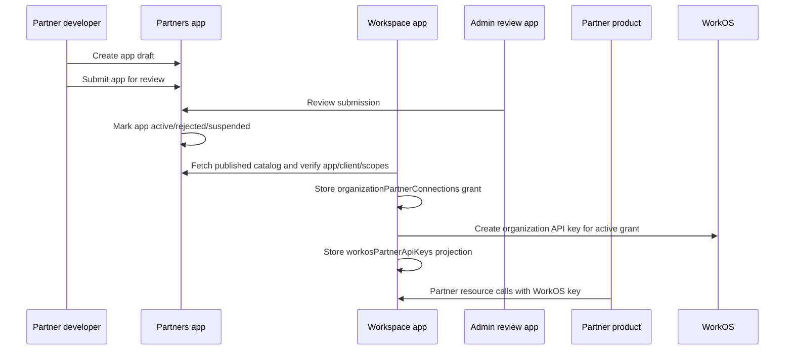

# Qentrah Setup And Configuration

This document is the repo-level setup guide for rebuilding, configuring, developing, and operating the Qentrah monorepo from a clean machine or a new deployment account.

It is written for maintainers, future developers, and integration engineers who need to understand the architecture, app boundaries, environment variables, external tokens, local development flow, and production deployment shape.

## Quick Start

Prerequisites:

- Node.js 20 or newer.
- npm, using the repository lockfile.
- A Convex account for the apps that use Convex.
- A Vercel account if deploying the apps.
- External service accounts only when the related feature is enabled: Google OAuth, UploadThing, OpenRouter, Sentry, and Mapbox.

Install dependencies from the repository root:

```bash
npm install
```

Run the main apps:

```bash
npm run dev:workspace  # http://localhost:3000
npm run dev:partners   # http://localhost:3002
npm run dev:admin      # http://localhost:3003
npm run dev:demo       # http://localhost:3004
npm run dev:marketing  # http://localhost:3005
```

Run checks:

```bash
npm run typecheck --workspaces --if-present
npm run test --workspaces --if-present
npm run build --workspaces --if-present
```

Target one workspace:

```bash
npm --workspace @qentrah/workspace run typecheck
npm --workspace @qentrah/partners run test
npm --workspace @qentrah/admin-review run build
npm --workspace @qentrah/demo-partner-app run build
```

## Repository Architecture

The repo is an npm workspaces monorepo.

```txt
qentrah/
  apps/
    workspace/          Main Qentrah product, OAuth provider, partner resource API, admin service API
    partners/           Partner developer portal, app registration, docs, sandbox
    admin/              Internal review console for partner app submissions
    demo-partner-app/   Standalone OAuth reference partner app
    marketing/          Public marketing site
  packages/
    auth/               Shared OAuth/OIDC and authorization primitives
    auth-client/        Better Auth client factories
    auth-sdk/           SDK package surface built on auth/platform packages
    authorization/      External organization authorization helpers
    domain-contracts/   Shared DTO and Zod contract schemas
    platform-core/      Core errors, classnames, locale, auth bridge utilities
    ui/                 Shared React UI primitives
    web-foundation/     Next/web helpers, providers, media utilities
    *-logic/            Pure domain logic packages
  docs/                 Repo-level and partner platform documentation
```

High-level app responsibilities:

| App | Local URL | Responsibility | Source of truth |
| --- | --- | --- | --- |
| Workspace | `http://localhost:3000` | Main product, organization auth, OAuth provider, partner resource APIs, reviewed app approvals | Organizations, consent, OAuth clients, partner resource access |
| Partners | `http://localhost:3002` | Developer portal, partner account, app drafts, submission flow, partner docs | Developer drafts, submission state, partner profile state |
| Admin Review | `http://localhost:3003` | Internal review UI for pending partner apps | Reads/writes through Workspace admin service APIs |
| Demo Partner App | `http://localhost:3004` | Deployable example of OAuth + partner resource calls | Local encrypted cookie session only |
| Marketing | `http://localhost:3005` | Public site and external navigation | Static/content-driven public messaging |

Shared packages should contain reusable logic, UI, and contracts. Apps should not import another app's generated Convex internals. If two apps need a contract, move the contract into `packages/*`.

## System Flow

Partner app lifecycle:



WorkOS partner resource flow:

1. Partner product renders `Authorize with Qentrah`.
2. Workspace AuthKit authenticates the user and selected organization through WorkOS.
3. Workspace verifies the published app, Partners client id, redirect URI, and requested scopes with Partners.
4. Workspace checks organization permissions and records the organization grant in Convex.
5. Workspace creates a WorkOS organization API key for the active grant and stores only its projection in Convex.
6. Partner stores the returned WorkOS key server-side and calls `QENTRAH_WORKSPACE_API_URL/api/v1/partner/...` with `Authorization: Bearer <workos_partner_key>`.
7. Workspace validates the WorkOS key, Convex key projection, organization grant, and resource/action permission on every request.

## Development Workflow

Recommended local startup order:

1. Install dependencies at the repo root.
2. Configure Workspace env and run Workspace/Convex.
3. Configure Partners env and run Partners/Convex.
4. Configure Admin Review if reviewing partner apps locally.
5. Configure Demo Partner App if testing the external partner OAuth flow.
6. Run targeted typecheck/test for the apps you changed before running the full repo checks.

Useful scripts:

| Command | Purpose |
| --- | --- |
| `npm run dev:workspace` | Starts Workspace Next.js and Convex together. |
| `npm run dev:partners` | Starts Partners; script auto-loads local env and selects port 3002 unless busy. |
| `npm run dev:admin` | Starts Admin Review on port 3003. |
| `npm run dev:demo` | Starts Demo Partner App on port 3004. |
| `npm run dev:marketing` | Starts Marketing on port 3005. |
| `npm --workspace <name> run typecheck` | TypeScript validation for one workspace. |
| `npm --workspace <name> test` | Vitest for one workspace. |
| `npm --workspace @qentrah/workspace run test:e2e` | Playwright E2E tests for Workspace. |

## Environment Strategy

Rules:

- Keep secrets out of Git. Commit only `.env.example` or `.env.local.example` files.
- Variables prefixed with `NEXT_PUBLIC_` are exposed to browser code. Never put secrets in them.
- Vercel env values are per project. Set env separately for Workspace, Partners, Admin, Demo, and Marketing.
- Convex env values live in the Convex deployment, not in Vercel, unless a Next.js runtime also needs the same value.
- Restart local dev servers after changing `.env.local`.
- Redeploy Vercel projects after changing production env values.

External docs:

- Vercel env variables: [vercel.com/docs/environment-variables](https://vercel.com/docs/environment-variables)
- Vercel CLI env commands: [vercel.com/docs/cli/env](https://vercel.com/docs/cli/env)
- Convex env variables: [docs.convex.dev/production/environment-variables](https://docs.convex.dev/production/environment-variables)
- WorkOS AuthKit docs: [workos.com/docs/user-management/authkit](https://workos.com/docs/user-management/authkit)
- UploadThing dashboard/docs: [docs.uploadthing.com](https://docs.uploadthing.com)
- OpenRouter keys: [openrouter.ai/settings/keys](https://openrouter.ai/settings/keys)
- Sentry project settings: [docs.sentry.io/platforms/javascript/guides/nextjs](https://docs.sentry.io/platforms/javascript/guides/nextjs)
- Google OAuth credentials: [console.cloud.google.com/apis/credentials](https://console.cloud.google.com/apis/credentials)
- Mapbox access tokens: [account.mapbox.com/access-tokens](https://account.mapbox.com/access-tokens)

## Workspace App Configuration

App path: `apps/workspace`

Local command:

```bash
npm run dev:workspace
```

Production project:

- Vercel root directory: `apps/workspace`
- Suggested domain: `https://app.<root-domain>`
- Convex deployment: Workspace-owned Convex deployment

Core env variables:

| Variable | Required | Where it lives | Purpose | Where to get it |
| --- | --- | --- | --- | --- |
| `NEXT_PUBLIC_SITE_URL` | Production | Vercel | Public Workspace base URL used by app links and auth flows. | Your deployed Workspace domain. |
| `SITE_URL` | Production | Vercel | Server-side canonical Workspace URL. | Same as Workspace domain. |
| `NEXT_PUBLIC_API_URL` | Production | Vercel/local | Public Workspace API origin. | Same as Workspace domain. |
| `NEXT_PUBLIC_CLERK_PUBLISHABLE_KEY` | Required | Vercel/local | Clerk browser publishable key. | Clerk dashboard. |
| `CLERK_SECRET_KEY` | Required | Vercel secret | Clerk server API key. | Clerk dashboard. |
| `CLERK_FRONTEND_API_URL` | Required | Vercel and Convex | Clerk issuer domain used by Convex auth config. | Clerk dashboard; use the domain configured for the Convex JWT template. |
| `PLATFORM_ADMIN_EMAILS` | Optional | Vercel | Comma-separated platform admin allowlist. | Internal admin list. |
| `CONVEX_DEPLOYMENT` | Local/dev | Local | Convex deployment selector. | Convex CLI/dashboard. |
| `NEXT_PUBLIC_CONVEX_URL` | Required | Vercel/local | Browser Convex URL. | Convex dashboard. |
| `CONVEX_URL` | Required for server/Convex bridge | Vercel/local | Convex cloud URL. | Convex dashboard. |
| `NEXT_PUBLIC_CONVEX_SITE_URL` | Required for auth bridge | Vercel/local | Public Convex site URL. | Convex dashboard; usually `.convex.site`. |
| `CONVEX_SITE_URL` | Required | Vercel/local | Convex site URL for deployment HTTP routes. | Convex dashboard. |
| `PARTNER_APPS_ENABLED` | Optional | Vercel | Enables partner app authorization and resource behavior; defaults true. | Set `false` only to disable partner app features. |
| `PARTNER_OAUTH_ISSUER` | Optional | Vercel | Partner OAuth issuer override. | Workspace URL. |
| `PARTNER_OAUTH_AUDIENCE` | Optional | Vercel | Partner API audience. | Workspace URL. |
| `PARTNERS_API_BASE_URL` | Required for partner catalog reads | Vercel | Partners API origin. | Partners deployment URL. |
| `NEXT_PUBLIC_PARTNERS_AUTH_URL` | Optional fallback | Vercel/local | Partners origin fallback. | Partners deployment URL. |
| `PARTNERS_PLATFORM_SERVICE_TOKEN` | Required for partner catalog reads | Vercel secret | Service token accepted by Partners platform APIs. | Generate a shared internal secret. |
| `WORKSPACE_CONVEX_BRIDGE_SECRET` | Required for partner/API resource calls | Vercel/Convex | Server-only token used by Workspace Hono routes when calling protected Convex resource functions. | Generate and store as secret. |
| `PARTNER_WEBHOOK_SECRET_ENCRYPTION_KEY` | Needed for encrypted partner webhooks | Convex/server | Encrypts stored partner webhook secrets. | Generate and store as secret. |
| `ORGANIZATION_DATA_ENCRYPTION_KEY` | Needed for organization data encryption | Convex/server | Master key for organization-scoped user/business data encryption. | Generate and store as secret. |
| `WORKSPACE_ADMIN_SERVICE_TOKEN` | Required for Admin Review | Vercel/Convex | Service token accepted by Workspace admin APIs. | Generate a shared internal secret. |
| `OPENROUTER_API_KEY` | Required for live AI agent responses | Vercel/Convex/server | Calls OpenRouter through the AI SDK provider. | OpenRouter dashboard. |
| `OPENROUTER_MODEL` | Optional | Vercel/Convex/server | Model ID; defaults to configured Qwen model. | OpenRouter model catalog. |
| `OPENROUTER_FALLBACK_MODELS` | Optional | Vercel/server | Fallback model IDs. | OpenRouter model catalog. |
| `OPENROUTER_APP_NAME` | Optional | Vercel/Convex/server | App attribution for OpenRouter. | Internal name. |
| `UPLOADTHING_TOKEN` | Optional shortcut | Vercel | Encoded UploadThing token; can hydrate secret/app ID. | UploadThing dashboard. |
| `UPLOADTHING_SECRET` | Required when using UploadThing without token | Vercel | UploadThing API secret. | UploadThing dashboard. |
| `UPLOADTHING_APP_ID` | Required when using UploadThing without token | Vercel | UploadThing app ID. | UploadThing dashboard. |
| `NEXT_PUBLIC_MAPBOX_ACCESS_TOKEN` | Optional | Vercel/local | Enables location picker/preview map UI. | Mapbox access token page. |
| `TAMARA_API_BASE_URL` | Required for production billing | Vercel | Tamara API origin. Use `https://api.tamara.co` in production. | Tamara merchant integration setup. |
| `TAMARA_API_TOKEN` | Required for billing | Vercel secret | Tamara merchant bearer token for checkout, authorise, capture, and order lookup. | Tamara Partners Portal API Tokens. |
| `TAMARA_NOTIFICATION_TOKEN` | Required for webhooks | Vercel secret | Verifies Tamara webhook JWT signatures. | Tamara merchant integration setup. |
| `TAMARA_PUBLIC_KEY` | Required for billing setup | Vercel | Tamara merchant public key. | Tamara merchant integration setup. |
| `TAMARA_WEBHOOK_URL` | Required for webhooks | Vercel | Public webhook endpoint: `https://app.qentrah.com/api/v1/billing/tamara/webhook`. | Workspace production domain. |
| `TAMARA_CAPTURE_MODE` | Required for billing | Vercel | Capture policy for the digital monthly plan. Set `immediate`. | Qentrah billing policy. |
| `NEXT_PUBLIC_SENTRY_DSN` | Optional | Vercel | Client Sentry DSN. | Sentry project settings. |
| `SENTRY_DSN` | Optional | Vercel | Server/edge Sentry DSN. | Sentry project settings. |
| `SENTRY_ORG` | Optional build upload | Vercel | Sentry source map upload org. | Sentry settings. |
| `SENTRY_PROJECT` | Optional build upload | Vercel | Sentry source map upload project. | Sentry settings. |
| `SENTRY_AUTH_TOKEN` | Optional build upload | Vercel | Token for Sentry source map upload. | Sentry user/org auth token. |
| `NEXT_PUBLIC_QENTRAH_PERF_DEBUG` | Optional local/debug | Vercel/local | Enables extra performance debug logs. | Set `1` only when debugging. |
| `NEXT_PUBLIC_API_URL` | Optional | Vercel/local | Public API base config exposed through `public.ts`. | Workspace API URL if needed. |
| `E2E_BASE_URL` | Optional tests | Local/CI | Playwright target URL. | Running app URL. |

Minimal local Workspace `.env.local` shape:

```bash
NEXT_PUBLIC_SITE_URL=http://localhost:3000
SITE_URL=http://localhost:3000
NEXT_PUBLIC_API_URL=http://localhost:3000
CONVEX_DEPLOYMENT=bright-sheep-471
NEXT_PUBLIC_CONVEX_URL=https://bright-sheep-471.convex.cloud
CONVEX_URL=https://bright-sheep-471.convex.cloud
NEXT_PUBLIC_CONVEX_SITE_URL=https://bright-sheep-471.convex.site
CONVEX_SITE_URL=https://bright-sheep-471.convex.site
NEXT_PUBLIC_CLERK_PUBLISHABLE_KEY=<clerk-publishable-key>
CLERK_SECRET_KEY=<clerk-secret-key>
CLERK_FRONTEND_API_URL=<clerk-frontend-api-url>
WORKSPACE_CONVEX_BRIDGE_SECRET=replace-with-at-least-32-characters
WORKSPACE_ADMIN_SERVICE_TOKEN=local-workspace-admin-token
```

Convex values to set for Workspace:

```bash
npx convex env set CLERK_FRONTEND_API_URL "<clerk-frontend-api-url>" --deployment bright-sheep-471
npx convex env set WORKSPACE_CONVEX_BRIDGE_SECRET "replace-with-at-least-32-characters" --deployment bright-sheep-471
npx convex env set ADMIN_CONVEX_SERVICE_TOKEN "local-admin-convex-token" --deployment bright-sheep-471
npx convex env set ORGANIZATION_DATA_ENCRYPTION_KEY "replace-with-at-least-32-characters" --deployment bright-sheep-471
npx convex env set PARTNER_WEBHOOK_SECRET_ENCRYPTION_KEY "replace-with-at-least-32-characters" --deployment bright-sheep-471
```

Use Convex dashboard or CLI for Convex env. Use Vercel project settings for Vercel env.

## Partners App Configuration

App path: `apps/partners`

Local command:

```bash
npm run dev:partners
```

Production project:

- Vercel root directory: `apps/partners`
- Suggested domain: `https://partners.<root-domain>`
- Convex deployment: Partners-owned Convex deployment

The repo includes `apps/partners/.env.example`.

Core env variables:

| Variable | Required | Where it lives | Purpose | Where to get it |
| --- | --- | --- | --- | --- |
| `SITE_URL` | Required production | Vercel/Convex | Canonical Partners URL. | Partners domain. |
| `NEXT_PUBLIC_PARTNERS_AUTH_URL` | Required | Vercel/local | Browser/server auth base URL for Partners. | Partners domain or `http://localhost:3002`. |
| `BETTER_AUTH_URL` | Optional | Vercel/Convex | Better Auth explicit base URL. | Partners domain. |
| `BETTER_AUTH_SECRET` | Required production | Vercel/Convex | Better Auth signing secret. | Generate with `openssl rand -base64 32`. |
| `CONVEX_DEPLOYMENT` | Optional CLI | Local | Convex deployment selector used by Convex CLI. | Convex dashboard/CLI. |
| `CONVEX_URL` | Required | Vercel/local | Partners Convex URL. | Convex dashboard. |
| `CONVEX_SITE_URL` | Required | Vercel/local/Convex | Partners Convex site URL. | Convex dashboard. |
| `NEXT_PUBLIC_CONVEX_URL` | Required | Vercel/local | Browser Convex URL; can be derived from `CONVEX_URL` by local script. | Convex dashboard. |
| `NEXT_PUBLIC_CONVEX_SITE_URL` | Required | Vercel/local | Browser-visible Convex site URL; can be derived from `CONVEX_SITE_URL`. | Convex dashboard. |
| `PARTNER_SIGNUP_BRIDGE_SECRET` | Required production | Vercel and Convex | Guards local/signup bridge into Better Auth. | Generate a shared internal secret. |
| `QENTRAH_WORKSPACE_API_URL` | Required for submission sync | Vercel/local | Workspace base URL. | Workspace deployment URL. |
| `QENTRAH_PLATFORM_API_URL` | Optional fallback | Vercel/local | Legacy/fallback Workspace API URL. | Workspace deployment URL. |
| `QENTRAH_PLATFORM_SERVICE_TOKEN` | Required for app submission sync | Vercel/local | Service token Partners uses to submit registrations to Workspace. | Must match Workspace admin/service configuration. |
| `QENTRAH_WORKSPACE_SERVICE_TOKEN` | Optional fallback | Vercel/local | Alternate service token name accepted by Partners config. | Generate shared internal secret. |
| `PARTNERS_REVIEW_CALLBACK_TOKEN` | Required production | Vercel and Workspace | Token used to verify review callbacks. | Generate shared internal secret. |

Minimal local Partners `.env.local`:

```bash
SITE_URL=http://localhost:3002
NEXT_PUBLIC_PARTNERS_AUTH_URL=http://localhost:3002
CONVEX_URL=https://<partners-deployment>.convex.cloud
CONVEX_SITE_URL=https://<partners-deployment>.convex.site
NEXT_PUBLIC_CONVEX_URL=https://<partners-deployment>.convex.cloud
NEXT_PUBLIC_CONVEX_SITE_URL=https://<partners-deployment>.convex.site
BETTER_AUTH_SECRET=replace-with-at-least-32-characters
PARTNER_SIGNUP_BRIDGE_SECRET=local-partner-signup-secret
QENTRAH_WORKSPACE_API_URL=http://localhost:3000
QENTRAH_PLATFORM_SERVICE_TOKEN=local-workspace-admin-token
PARTNERS_REVIEW_CALLBACK_TOKEN=local-review-callback-token
```

Convex values to set for Partners:

```bash
npx convex env set SITE_URL "http://localhost:3002"
npx convex env set NEXT_PUBLIC_PARTNERS_AUTH_URL "http://localhost:3002"
npx convex env set BETTER_AUTH_SECRET "replace-with-at-least-32-characters"
npx convex env set PARTNER_SIGNUP_BRIDGE_SECRET "local-partner-signup-secret"
npx convex env set PARTNERS_REVIEW_CALLBACK_TOKEN "local-review-callback-token"
```

## Admin Review App Configuration

App path: `apps/admin`

Local command:

```bash
npm run dev:admin
```

Production project:

- Vercel root directory: `apps/admin`
- Suggested domain: `https://admin.<root-domain>`
- No app-owned database; it talks to Workspace admin APIs.

Env variables:

| Variable | Required | Where it lives | Purpose | Where to get it |
| --- | --- | --- | --- | --- |
| `WORKSPACE_API_BASE_URL` | Required | Vercel/local | Workspace base URL used by Admin Review. | Workspace deployment URL. |
| `WORKSPACE_ADMIN_SERVICE_TOKEN` | Required | Vercel/local | Bearer token sent to Workspace admin APIs. | Same internal secret accepted by Workspace. |

Minimal local Admin `.env.local`:

```bash
WORKSPACE_API_BASE_URL=http://localhost:3000
WORKSPACE_ADMIN_SERVICE_TOKEN=local-workspace-admin-token
```

## Demo Partner App Configuration

App path: `apps/demo-partner-app`

Local command:

```bash
npm run dev:demo
```

Production project:

- Vercel root directory: `apps/demo-partner-app`
- Suggested domain: `https://demo.<root-domain>`
- The app stores demo tokens in an encrypted HttpOnly cookie. Production partner apps should use durable backend storage instead.

Env variables:

| Variable | Required | Where it lives | Purpose | Where to get it |
| --- | --- | --- | --- | --- |
| `QENTRAH_WORKSPACE_API_URL` | Required | Vercel/local | Workspace base URL for OAuth and partner APIs. | Workspace deployment URL. |
| `QENTRAH_CLIENT_ID` | Required | Vercel/local | Approved OAuth client ID for this partner app. | Partners app record after registration/review. |
| `QENTRAH_CLIENT_SECRET` | Optional | Vercel/local | OAuth client secret for confidential clients. | Partners/Workspace OAuth client record, if confidential. |
| `PARTNER_APP_URL` | Required | Vercel/local | Public URL of the demo partner app. | Demo deployment URL or `http://localhost:3004`. |
| `DEMO_ACCESS_TOKEN` | Required | Vercel/local | Gate token for opening public demo URL. | Generate any strong random string. |
| `SESSION_SECRET` | Required | Vercel/local | Encrypts HttpOnly token cookie; minimum 32 characters. | Generate with `openssl rand -base64 32`. |

Minimal local Demo `.env.local`:

```bash
QENTRAH_WORKSPACE_API_URL=http://localhost:3000
QENTRAH_CLIENT_ID=partners_client_...
QENTRAH_CLIENT_SECRET=
PARTNER_APP_URL=http://localhost:3004
DEMO_ACCESS_TOKEN=demo-token
SESSION_SECRET=abcdefghijklmnopqrstuvwxyz123456
```

Demo OAuth checklist:

1. Start Workspace at `http://localhost:3000`.
2. Start Partners at `http://localhost:3002`.
3. Create a partner app in Partners.
4. Use `http://localhost:3004` as the partner app URL.
5. Use `http://localhost:3004/api/auth/qentrah/callback` as redirect URI.
6. Request read scopes first: `organization:read`, `client:read`, `property:read`.
7. Approve/sync the app through Admin Review or the relevant local flow.
8. Copy the OAuth client ID into `QENTRAH_CLIENT_ID`.
9. Open `http://localhost:3004`, unlock with `DEMO_ACCESS_TOKEN`, then authorize.

## Marketing App Configuration

App path: `apps/marketing`

Local command:

```bash
npm run dev:marketing
```

Production project:

- Vercel root directory: `apps/marketing`
- Suggested domain: root marketing domain, for example `https://qentrah.com`

Env variables:

| Variable | Required | Where it lives | Purpose | Where to get it |
| --- | --- | --- | --- | --- |
| `NEXT_PUBLIC_WORKSPACE_URL` | Optional | Vercel/local | Link target for Workspace CTAs; defaults to `https://app.qentrah.com`. | Workspace production URL. |
| `NEXT_PUBLIC_PARTNERS_URL` | Optional | Vercel/local | Link target for Partners CTAs; defaults to `https://partners.qentrah.com`. | Partners production URL. |

## Package Configuration

Packages under `packages/*` are mostly pure TypeScript libraries. They generally do not own runtime env. Important exceptions:

- `@qentrah/location-map` reads `NEXT_PUBLIC_MAPBOX_ACCESS_TOKEN` from the host app.
- `@qentrah/platform-core` contains helpers that read auth/Convex env through app-provided contexts.
- `@qentrah/auth` reads OIDC-related env only when used by a host app/package runtime.

Build/test package examples:

```bash
npm --workspace @qentrah/domain-contracts run build
npm --workspace @qentrah/ui run test
npm --workspace @qentrah/auth-sdk run build
```

## External Token Sources

Use this table when setting up a new environment.

| Token/value | Provider | Source link | Notes |
| --- | --- | --- | --- |
| Convex deployment URL | Convex | [Convex dashboard](https://dashboard.convex.dev) | Use `.convex.cloud` for `CONVEX_URL`/`NEXT_PUBLIC_CONVEX_URL`. |
| Convex site URL | Convex | [Convex dashboard](https://dashboard.convex.dev) | Usually the same deployment slug with `.convex.site`. |
| Convex env vars | Convex | [Convex env docs](https://docs.convex.dev/production/environment-variables) | Set secrets with dashboard or `npx convex env set`. |
| Vercel project env | Vercel | [Vercel env docs](https://vercel.com/docs/environment-variables) | Configure separately per Vercel project. |
| WorkOS AuthKit credentials | WorkOS | [WorkOS dashboard](https://dashboard.workos.com) | Use Workspace application credentials and webhook secret. |
| Google OAuth client | Google Cloud | [Google credentials](https://console.cloud.google.com/apis/credentials) | Add local and production redirect/origin values. |
| UploadThing token/secret | UploadThing | [UploadThing docs](https://docs.uploadthing.com) | `UPLOADTHING_TOKEN` can hydrate `UPLOADTHING_SECRET` and `UPLOADTHING_APP_ID`. |
| OpenRouter key | OpenRouter | [OpenRouter keys](https://openrouter.ai/settings/keys) | Required for live AI agent model responses. |
| Sentry DSN/token | Sentry | [Sentry Next.js docs](https://docs.sentry.io/platforms/javascript/guides/nextjs) | DSN is not a write secret; auth token is a secret. |
| Mapbox public token | Mapbox | [Mapbox tokens](https://account.mapbox.com/access-tokens) | Public token only; restrict domain where possible. |
| Workspace service tokens | Internal | Internal secret manager | Generate random strings; values must match across calling and receiving apps. |

Generate internal secrets:

```bash
openssl rand -base64 32
```

Suggested internal token mapping:

| Same secret value | Set in |
| --- | --- |
| Workspace admin/service token | `WORKSPACE_ADMIN_SERVICE_TOKEN` in Workspace/Admin, `QENTRAH_PLATFORM_SERVICE_TOKEN` in Partners |
| Review callback token | `PARTNERS_REVIEW_CALLBACK_TOKEN` in Workspace and Partners |
| Partner signup bridge token | `PARTNER_SIGNUP_BRIDGE_SECRET` in Partners Vercel and Partners Convex |

## Local End-To-End Setup

Use this path when rebuilding everything locally:

1. Clone the repo and run `npm install`.
2. Create or select a Workspace Convex deployment.
3. Create or select a Partners Convex deployment.
4. Set Workspace `.env.local`.
5. Set Workspace Convex env values.
6. Set Partners `.env.local`.
7. Set Partners Convex env values.
8. Set Admin `.env.local`.
9. Set Demo `.env.local`.
10. Start Workspace, Partners, Admin, and Demo in separate terminals.
11. Sign in to Partners and create a partner app.
12. Submit the partner app for review.
13. Review/approve through Admin Review.
14. Open the Demo Partner App and complete OAuth.
15. Confirm demo reads organization, clients, and properties through Workspace APIs.

Expected local ports:

| App | Port |
| --- | --- |
| Workspace | 3000 |
| Partners | 3002 |
| Admin Review | 3003 |
| Demo Partner App | 3004 |
| Marketing | 3005 |

## Production Deployment Shape

Use separate Vercel projects:

| Vercel project | Root directory | Suggested domain |
| --- | --- | --- |
| Workspace | `apps/workspace` | `app.<root-domain>` |
| Partners | `apps/partners` | `partners.<root-domain>` |
| Admin Review | `apps/admin` | `admin.<root-domain>` |
| Demo Partner App | `apps/demo-partner-app` | `demo.<root-domain>` |
| Marketing | `apps/marketing` | `<root-domain>` |

Deployment rules:

- Do not share all env across all Vercel projects.
- Only share explicit service tokens that cross app boundaries.
- Keep Workspace and Partners Convex deployments separate.
- Redeploy after env changes.
- Add production URLs to Better Auth trusted origins if needed.
- Add OAuth redirect URIs for each partner app environment.

## Integration Boundaries

Workspace owns:

- Organization data.
- User sign-in and organization access.
- OAuth authorization and token exchange.
- Partner app approval state.
- Partner resource APIs.
- Admin service APIs.

Partners owns:

- Developer identity and programmer organizations.
- Partner app drafts and submitted app metadata.
- Partner docs and sandbox/developer examples.
- Syncing submitted apps into Workspace for review.

Admin Review owns:

- Review UI only.
- It does not own durable partner app data.
- It calls Workspace admin APIs with a service token.

Demo Partner App owns:

- Reference OAuth implementation.
- Temporary encrypted cookie session.
- Example server-side calls to Workspace partner APIs.

Marketing owns:

- Public messaging.
- Links into Workspace and Partners.

## Important Runtime Paths

Workspace:

- WorkOS login: `/api/auth/workos/login`
- WorkOS callback: `/api/auth/workos/callback`
- WorkOS partner key issuance: `/api/v1/organizations/:organizationId/partner-workos-api-keys`
- Partner resources: `/api/v1/partner/organizations/:organizationId/...`
- Partner connections: `/api/v1/organizations/:organizationId/partner-connections`
- Agent chat: `/api/.../agents/chat` through organization routing

Partners:

- Docs: `/docs`
- App dashboard: `/dashboard/apps`
- Review callback: `/api/qentrah-review-callback`
- Sandbox OAuth: `/sandbox/oauth/authorize`, `/sandbox/oauth/token`
- Sandbox partner resources: `/api/v1/partner/organizations/:organizationId/...`

Demo Partner App:

- Partner authorization start: `/api/auth/qentrah/start`
- Partner authorization callback: `/api/auth/qentrah/callback`
- Logout: `/api/auth/qentrah/logout`
- Local proxy APIs: `/api/qentrah/me`, `/api/qentrah/clients`, `/api/qentrah/properties`

## Validation Checklist

Before opening a PR or deploying:

```bash
npm run typecheck --workspaces --if-present
npm run test --workspaces --if-present
npm run build --workspaces --if-present
```

For partner-platform changes:

```bash
npm --workspace @qentrah/workspace run typecheck
npm --workspace @qentrah/partners run typecheck
npm --workspace @qentrah/admin-review run typecheck
npm --workspace @qentrah/demo-partner-app run typecheck
npm --workspace @qentrah/partners test
npm --workspace @qentrah/admin-review test
npm --workspace @qentrah/demo-partner-app test
```

For docs/MDX changes in Partners:

```bash
npm --workspace @qentrah/partners run build
```

For Workspace UI or auth changes:

```bash
npm --workspace @qentrah/workspace run test
npm --workspace @qentrah/workspace run test:e2e
```

## Troubleshooting

`Clerk or Convex auth is not configured.`

- Add `NEXT_PUBLIC_CLERK_PUBLISHABLE_KEY`, `CLERK_SECRET_KEY`, and `CLERK_FRONTEND_API_URL`.
- Confirm `CLERK_FRONTEND_API_URL` is also set on the Workspace Convex deployment.
- Confirm the Workspace Convex URLs point at `bright-sheep-471`.

`Partners auth is missing Convex auth URLs`

- Set `CONVEX_URL` or `NEXT_PUBLIC_CONVEX_URL`.
- Set `CONVEX_SITE_URL` or `NEXT_PUBLIC_CONVEX_SITE_URL`.
- Restart `npm run dev:partners`.

Partner app submission fails from Partners:

- Confirm Workspace is running.
- Confirm `QENTRAH_WORKSPACE_API_URL` points to Workspace.
- Confirm `QENTRAH_PLATFORM_SERVICE_TOKEN` in Partners matches the token Workspace expects.
- Confirm the app has at least one approved/requested partner API scope.

Admin Review cannot load apps:

- Confirm `WORKSPACE_API_BASE_URL`.
- Confirm `WORKSPACE_ADMIN_SERVICE_TOKEN`.
- Confirm Workspace admin API routes are running.

Demo Partner App authorization callback fails:

- Confirm `PARTNER_APP_URL` exactly matches the registered redirect URI origin.
- Confirm redirect URI is registered as `${PARTNER_APP_URL}/api/auth/qentrah/callback`.
- Confirm `QENTRAH_CLIENT_ID` matches the approved Partners client.
- Confirm `SESSION_SECRET` is at least 32 characters.
- Confirm the Workspace organization has an active partner connection grant and WorkOS partner key projection.

Workspace partner resource API returns `connection_expired`:

- Send the user through `Authorize with Qentrah` again.
- A production partner app should keep reconnect UX available.

Workspace partner resource API returns `scope_denied`:

- The app did not request or receive the required scope.
- Update the partner app scopes, submit/review again, then reconnect.

UploadThing does not work:

- Set either `UPLOADTHING_TOKEN`, or set both `UPLOADTHING_SECRET` and `UPLOADTHING_APP_ID`.
- Restart the Workspace app after env changes.

OpenRouter agent response is missing:

- Set `OPENROUTER_API_KEY`.
- Confirm the configured `OPENROUTER_MODEL` exists and is available to the key.

Map UI shows a token warning:

- Set `NEXT_PUBLIC_MAPBOX_ACCESS_TOKEN` in the host app.
- Restrict the token to expected domains in Mapbox.

## Documentation Map

Start here:

- `README.md`: project overview, quick start, app map, and validation commands.
- `docs/operations/setup-and-configuration.md`: complete setup, env, token, and deployment guide.
- `docs/README.md`: repo-level documentation index.
- `docs/architecture/system-architecture.md`: cross-app architecture, ownership, and integration flow.
- `docs/architecture/apps-and-packages.md`: app and package catalog.
- `docs/operations/environment.md`: canonical env variable reference.
- `docs/engineering/feature-lifecycle.md`: feature planning, implementation, validation, docs, release, and deprecation flow.
- `docs/engineering/agent-guide.md`: safe navigation and editing guidance for AI agents and human maintainers.
- `docs/operations/monorepo-deployment.md`: concise deployment and app-boundary summary.
- `docs/partner-platform/README.md`: partner platform flow.
- `docs/partner-platform/partner-implementation-guide.md`: partner integration code examples.
- `apps/workspace/README.md`: Workspace app guide.
- `apps/partners/README.md`: Partners app guide.
- `apps/admin/README.md`: Admin Review app guide.
- `apps/demo-partner-app/README.md`: standalone partner OAuth demo.
- `apps/marketing/README.md`: Marketing app guide.
- `apps/partners/content/docs/ai-agent-implementation.mdx`: copy-ready AI agent implementation prompt.
- `apps/workspace/docs/README.md`: Workspace domain documentation index.

When changing architecture, update this file and the narrower docs that cover the affected app.
