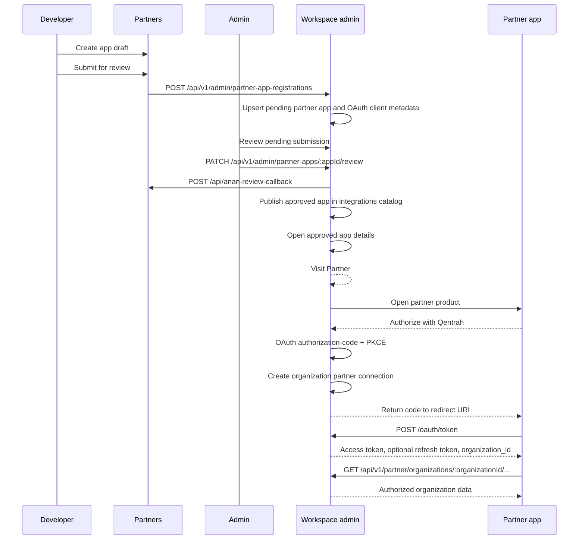

# Qentrah Partner Platform Flow

This document explains how Partners, Admin, Workspace, workspace authorization, and partner apps work together.

The product model is organization-level OAuth. A workspace user does not authorize personal data for a partner app. A user with the `oauthApp:authorize` permission authorizes a partner app for the whole organization, for the approved scopes, for a limited lifetime.

## Apps And Ownership

| App | Local port | Responsibility | Source of truth |
| --- | --- | --- | --- |
| Workspace | `http://localhost:3000` | OAuth server, partner app approval state, catalog, organization consent, partner resource APIs | Approved apps, OAuth clients, organization partner connections |
| Partners | `http://localhost:3002` | Developer portal, drafts, app setup, submission history | Developer drafts and submission state |
| Admin | `http://localhost:3003` | Internal review UI for pending partner app submissions | Review action UI, backed by Workspace APIs |
| Demo partner app | `http://localhost:3004` | Standalone partner implementation example | Partner-side OAuth/session/token storage example |

Workspace owns production authorization. Partners owns developer drafts. Admin is a review surface over Workspace service APIs. Partner apps only access workspace data through Workspace Hono APIs.

## Business Flow



## Developer App Registration

The developer creates an app in Partners with:

- App name and publisher.
- Partner app URL. This is where Workspace sends users when they click `Visit Partner`.
- Redirect URI. Example: `https://partner.example.com/api/auth/anan/callback`.
- Client type: public PKCE for browser-started flows, confidential for trusted server apps.
- Requested scopes. V1 supports read scopes and safe client write scopes.
- Optional logo, icon, and webhook settings.

Partners stores draft state locally. Drafts do not appear in Workspace.

On submit, Partners sends a versioned registration payload to Workspace. Workspace upserts the partner app as `pending` and syncs OAuth client metadata. Approval changes the Workspace partner app to `approved` and publishes it to the catalog.

## Admin Review

Admin calls Workspace with a service token:

```txt
GET   /api/v1/admin/partner-apps
PATCH /api/v1/admin/partner-apps/:appId/review
```

Review statuses:

- `approved`: app can appear in Workspace Integrations and can complete OAuth.
- `rejected`: app remains unavailable to workspace users.
- `suspended`: existing catalog/authorization access should be blocked.

When Admin approves, Workspace syncs the OAuth client and calls Partners:

```txt
POST /api/anan-review-callback
```

Partners then marks the developer app `active`.

## Workspace Integrations

Workspace Integrations has two production paths:

- Catalog: approved partner apps only.
- Connected: organization partner connections with status.

Demo-only Zustand integration state must stay out of the production catalog path.

Catalog action in v1 is:

```txt
Visit Partner
```

The partner page then shows:

```txt
Authorize with Qentrah
```

## OAuth Authorization

Partners use OAuth 2.1 authorization code with PKCE.

Authorization endpoint:

```txt
GET {QENTRAH_WORKSPACE_API_URL}/oauth/authorize
```

Token endpoint:

```txt
POST {QENTRAH_WORKSPACE_API_URL}/oauth/token
```

Required authorization parameters:

| Parameter | Value |
| --- | --- |
| `response_type` | `code` |
| `client_id` | Approved OAuth client ID |
| `redirect_uri` | Registered callback URI |
| `scope` | Space-separated approved scopes |
| `resource` | `{QENTRAH_WORKSPACE_API_URL}/api/v1/partner` |
| `state` | Random CSRF value stored server-side |
| `code_challenge` | S256 PKCE challenge |
| `code_challenge_method` | `S256` |

The `resource` parameter is important. Without it, Workspace can issue an opaque access token. Partner Hono APIs expect a JWT access token with the partner API audience.

## Organization Consent

Workspace handles:

- Sign-in if the user is not authenticated.
- Organization selection if no active organization is selected.
- Permission checks for `oauthApp:authorize`.
- Scope checks against the app approval record.
- Consent and organization partner connection creation.

Connection defaults:

| Setting | Value |
| --- | --- |
| Lifetime | 14 days |
| Scope model | Organization-level |
| User role | Only decides whether the user can grant/revoke |
| Delete scopes | Hidden from normal self-serve v1 |

Workspace stores organization partner connections with:

- `organizationId`
- Workspace partner app ID
- OAuth client ID
- `authorizedByUserId`
- approved `scopes`
- `status`
- `expiresAt`

## Partner Resource APIs

Partner data access must go through Workspace Hono routes:

```txt
GET   /api/v1/partner/organizations/:organizationId/me
GET   /api/v1/partner/organizations/:organizationId/clients
POST  /api/v1/partner/organizations/:organizationId/clients
PATCH /api/v1/partner/organizations/:organizationId/clients/:clientId
GET   /api/v1/partner/organizations/:organizationId/properties
GET   /api/v1/partner/organizations/:organizationId/projects
GET   /api/v1/partner/organizations/:organizationId/tasks
GET   /api/v1/partner/organizations/:organizationId/calendar
GET   /api/v1/partner/organizations/:organizationId/media
POST  /api/v1/partner/organizations/:organizationId/webhooks/inbound
```

Every resource request is checked for:

- Bearer token exists in the `Authorization` header.
- JWT signature via `/api/auth/convex/jwks`.
- Issuer and audience.
- Token organization matches the route organization.
- OAuth client belongs to an approved app.
- Organization partner connection exists, is active, and is not expired.
- Requested token scopes match connection scopes.
- Resource/action scope is present.

Common errors:

| Error | Meaning |
| --- | --- |
| `missing_bearer` | No bearer token was sent. |
| `wrong_organization` | Token organization does not match the URL organization. |
| `app_not_approved` | OAuth client is not tied to an approved app. |
| `connection_not_found` | Workspace has not authorized this app. |
| `connection_expired` | Authorization lifetime ended; user must reconnect. |
| `scope_denied` | Token/connection does not include the required scope. |

## Configuration

Partners:

```bash
QENTRAH_WORKSPACE_API_URL=http://localhost:3000
QENTRAH_PLATFORM_SERVICE_TOKEN=shared-service-token
```

Admin:

```bash
WORKSPACE_API_BASE_URL=http://localhost:3000
WORKSPACE_ADMIN_SERVICE_TOKEN=shared-service-token
```

Workspace:

```bash
SITE_URL=http://localhost:3000
NEXT_PUBLIC_SITE_URL=http://localhost:3000
PARTNER_APPS_ENABLED=true
WORKSPACE_ADMIN_SERVICE_TOKEN=shared-service-token
PARTNERS_REVIEW_CALLBACK_TOKEN=shared-service-token
```

Optional Workspace overrides:

```bash
PARTNER_OAUTH_ISSUER=http://localhost:3000
PARTNER_OAUTH_AUDIENCE=http://localhost:3000/api/v1/partner
```

Demo partner app:

```bash
QENTRAH_WORKSPACE_API_URL=http://localhost:3000
QENTRAH_CLIENT_ID=partners_client_...
QENTRAH_CLIENT_SECRET=
PARTNER_APP_URL=http://localhost:3004
DEMO_ACCESS_TOKEN=demo-token
SESSION_SECRET=abcdefghijklmnopqrstuvwxyz123456
```

Leave `QENTRAH_CLIENT_SECRET` empty for public PKCE apps.

## Local Acceptance Checklist

1. Start Workspace on `http://localhost:3000`.
2. Start Partners on `http://localhost:3002`.
3. Start Admin on `http://localhost:3003`.
4. Start the demo app on `http://localhost:3004`.
5. In Partners, create an app:
   - Name: `Qentrah OAuth Demo`
   - Publisher: `ZA`
   - Partner URL: `http://localhost:3004`
   - Redirect URI: `http://localhost:3004/api/auth/anan/callback`
   - Scopes: `organization:read`, `client:read`, `property:read`, `client:create`, `client:update`
6. Submit for review.
7. Approve in Admin.
8. Copy the approved client ID to the demo app `QENTRAH_CLIENT_ID`.
9. Open the demo, unlock it, and click `Authorize with Qentrah`.
10. Consent in Workspace.
11. Confirm the demo reads organization, clients, and properties.
12. Create and update a demo client through Workspace Hono APIs.

## Developer Guide

For partner-facing implementation details and copy-ready code, see [Partner Implementation Guide](./partner-implementation-guide.md).
