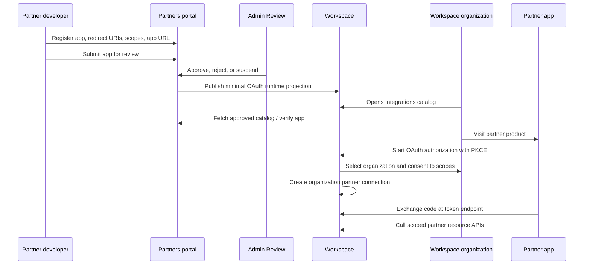

# Qentrah Product Knowledge Base

This knowledge base is the short, durable map for knowing Qentrah well enough to explain it, sell it, design around it, and turn it into a startup pitch deck.

## The Key To Knowing The Product

Qentrah is not only a real estate workspace, and it is not only an integration platform. The product is the trust layer between daily real estate operations and approved outside tools.

The key sentence:

> Qentrah lets real estate organizations run their work in one Workspace, then safely extend that work through approved apps, scoped organization consent, and API access that stays under the organization's control.

Everything else should ladder up to that idea.

## Product In One Line

Qentrah is a Saudi real estate operating workspace with a controlled partner app platform for integrations, automation, and AI-assisted workflows.

## Product In A Founder Pitch

Real estate teams lose speed and trust when clients, properties, projects, approvals, files, calendar work, and external tools live in disconnected systems. Qentrah creates one operational workspace for the organization, then gives approved partners and AI agents a safe way to connect through OAuth, scoped permissions, organization-level consent, and resource APIs.

This turns integration from an ad hoc technical project into a governed product flow: developers register apps, Qentrah reviews them, organizations authorize them, and Workspace enforces exactly what each app can read or write.

## Core Product Thesis

Real estate companies do not need another isolated dashboard. They need an operating system where work, trust, and integrations meet.

Qentrah's product advantage comes from combining:

- A real estate Workspace for daily operational work.
- A Partners portal for app registration, review, docs, and sandbox testing.
- Admin Review for approving or suspending partner apps.
- OAuth 2.1 with PKCE for secure organization authorization.
- Partner resource APIs that enforce app approval, active organization grants, expiration, and least-privilege scopes.
- Agent and MCP links that expose approved organization tools to AI workflows without giving agents normal dashboard access.

## Primary Users

Workspace users:

- Brokers and sales teams managing clients, follow-ups, and property activity.
- Coordinators handling calendar work, media, files, approvals, and tasks.
- Organization owners and admins managing teams, permissions, integrations, and data trust.

Partner users:

- Software vendors building real estate tools around Qentrah data.
- Internal developer teams connecting operational systems.
- AI and automation builders that need scoped access to approved organization data.

Internal users:

- Qentrah operators reviewing partner apps, checking risk, approving scopes, and suspending unsafe integrations.

## What Qentrah Owns

Workspace owns customer work and enforcement:

- Organizations, members, roles, and permissions.
- Authenticated product pages and real estate workflows.
- OAuth authorize, consent, organization selection, and token routes.
- Organization partner connections and grants.
- Partner resource APIs.
- Business data in Convex.
- Agent links and MCP access to organization-scoped tools.

Partners owns developer product truth:

- Partner developer accounts.
- App drafts, submissions, review status, redirect URIs, allowed scopes, publisher identity, docs, and sandbox.
- Published app catalog state.
- Platform APIs that Workspace uses to verify approved apps.

Admin Review owns the review surface:

- Reads pending app submissions.
- Writes approve, reject, or suspend decisions back through Partners APIs.
- Does not own canonical partner app data.

Demo Partner App proves the integration contract:

- Starts OAuth with PKCE.
- Exchanges authorization codes server-side.
- Stores tokens server-side.
- Calls Workspace resource APIs.

Marketing owns public positioning:

- Public content only.
- No dependency on private Workspace or Partners runtime data.

## The Product Flow

## Integration Model

The integration model is organization-level OAuth.

A user does not authorize only personal data. A user with the right permission authorizes an app for the organization, for approved scopes, for a limited lifetime. Workspace then stores an organization partner connection and enforces every API request against that connection.

Default authorization lifetime:

- 14 days.

Required authorization shape:

- OAuth 2.1 authorization code flow.
- PKCE S256.
- Server-side token exchange.
- Server-side token storage.
- Bearer tokens sent only in the `Authorization` header.
- Resource audience set to the Workspace partner API.

## Resource Access Rules

Every partner API request must pass these checks:

- Bearer token exists.
- JWT signature is valid.
- Issuer and audience are correct.
- Token organization matches the route organization.
- OAuth client belongs to a published Partners app.
- Organization partner connection exists.
- Connection is active and not expired.
- Token scopes match connection scopes.
- Requested resource/action scope is present.

This is the security story in plain language:

> Apps do not get blanket workspace access. They get reviewed, scoped, organization-approved access, and every request is checked again at the resource boundary.

## Current Partner Resource Surface

The platform shape supports partner APIs for:

- Organization profile and connection context.
- Clients.
- Properties.
- Projects.
- Tasks.
- Calendar.
- Media.
- Inbound webhooks.

The demo partner app currently proves organization, clients, and properties, with safe server-side create/update paths for clients.

## AI And Agent Story

Qentrah's AI story should be framed as controlled operational access, not generic AI decoration.

Qentrah can expose organization-scoped MCP links so agents such as ChatGPT, Claude, Cursor, Codex, Grok, or custom assistants can call approved tools. Each link is tied to a specific organization and permission set. The organization can create small links for specific jobs, rotate them after exposure, and revoke them without breaking the rest of the workspace.

The pitch:

> AI agents become useful when they can act on trusted operational data. Qentrah gives them approved tools instead of dashboard logins or scraped context.

## Product Pillars

### 1. Workspace As Operating Desk

The Workspace is where teams manage the work that matters every day: clients, properties, projects, calendar, tasks, activity, media, team members, organization settings, and integrations.

Pitch meaning:

- Qentrah is not a thin integration layer.
- It starts from real operational work.
- Integrations extend a live system of record.

### 2. Trust As A Product Feature

Trust is visible in permissions, approvals, organization grants, scope enforcement, expiry, auditability, and review status.

Pitch meaning:

- Qentrah can support serious business workflows.
- It reduces integration risk.
- It gives organization owners control over connected tools.

### 3. Partners As The Growth Loop

Partners is the developer surface where external tools can join the ecosystem through app registration, docs, sandbox, review, and approved catalog distribution.

Pitch meaning:

- Qentrah can grow beyond first-party features.
- Every approved partner adds value to the Workspace.
- The product becomes a platform without surrendering control.

### 4. APIs And Agents As Distribution

Partner APIs, SDK helpers, sandbox logs, and MCP links make Qentrah programmable.

Pitch meaning:

- Developers can build against Qentrah.
- AI workflows can use approved data and tools.
- Enterprise teams can automate without bypassing governance.

## Differentiation

Qentrah is different from a generic CRM because it is domain-shaped around real estate operations, not generic contacts and pipelines.

Qentrah is different from a marketplace because app access is governed through organization consent, scoped grants, and resource enforcement.

Qentrah is different from a pure API platform because it begins with the Workspace, where the organization's real work and permissions already live.

Qentrah is different from generic AI tooling because agents receive approved, typed access to organization tools instead of broad credentials or copied data.

## Pitch Deck Narrative

Use this sequence when turning the product into a deck.

### Slide 1: Title

Qentrah

The trusted operating workspace for real estate teams and approved integrations.

### Slide 2: Problem

Real estate work is fragmented across teams, spreadsheets, CRMs, portals, files, calendars, messaging apps, and vendor tools.

The result:

- Slow follow-up.
- Poor visibility into ownership and next action.
- Risky data sharing with external tools.
- Manual integration work.
- AI and automation blocked by unclear permissions.

### Slide 3: Insight

The winning real estate platform is not only a system of record. It is the controlled connection point between operations, partner apps, and AI agents.

### Slide 4: Solution

Qentrah gives organizations:

- One Workspace for daily real estate operations.
- One approved path for partner integrations.
- One consent model for organization-level access.
- One resource API layer that enforces scopes, expiry, and active grants.

### Slide 5: Product

Show the product as three connected surfaces:

- Workspace: clients, properties, projects, tasks, calendar, media, team, organization settings, integrations.
- Partners: developer accounts, app drafts, redirect URIs, scopes, docs, sandbox, published catalog.
- Admin Review: approve, reject, suspend, and manage risk before apps reach customers.

### Slide 6: Integration Flow

Developer registers app -> Admin reviews -> app appears in Workspace catalog -> organization visits partner -> OAuth consent -> 14-day organization grant -> partner API access with scoped enforcement.

### Slide 7: Trust And Security

Lead with the controls:

- OAuth 2.1 with PKCE.
- Server-side token exchange and storage.
- Organization-level consent.
- Role permission required to authorize apps.
- Scope checks on every resource request.
- Expiring grants.
- Review and suspension path.
- No browser exposure of access tokens.

### Slide 8: Platform Expansion

Qentrah can expand through:

- More Workspace workflows.
- More partner app categories.
- More resource APIs.
- More agent tools through MCP.
- More automation around approvals, calendar, clients, properties, media, and projects.

### Slide 9: Why Now

Real estate teams are adopting software, automation, and AI faster than their permission models can safely support. They need integration and agent access, but only if the organization remains in control.

### Slide 10: Business Model

Possible packaging:

- Workspace subscription per organization or seat.
- Partner platform fees for approved apps or higher API tiers.
- Add-on modules for advanced integrations, AI/agent links, automation, data governance, or compliance.

### Slide 11: Moat

Qentrah's defensibility compounds through:

- Organization data and workflow context.
- Partner app review and catalog.
- OAuth runtime projection and grant enforcement.
- Domain-specific resource APIs.
- Developer docs, sandbox, SDKs, and integration evidence.
- Trust earned through controlled access.

### Slide 12: Ask

Frame the ask around accelerating:

- Workspace product depth.
- Partner platform launch.
- First approved integrations.
- Real estate organization pilots.
- AI/agent workflow proof points.

## Messaging Bank

Short positioning:

- The workspace where real estate work and trusted integrations meet.
- One operating desk for real estate teams. One approved path for connected apps.
- Real estate operations, partner apps, and AI agents under organization control.

Customer value:

- Know what needs action today.
- Keep permissions and approvals visible.
- Connect tools without losing control of workspace data.
- Let agents work through approved tools, not shared logins.

Developer value:

- Register an app once.
- Build against documented OAuth and resource APIs.
- Test in sandbox.
- Prove request shape through logs.
- Reach organizations through the Workspace integration catalog.

Investor value:

- Qentrah starts with workflow ownership, then expands through platform distribution.
- The integration layer creates a compounding ecosystem around the Workspace.
- Trust, permissions, and resource enforcement are built into the product architecture, not added later.

## Terms To Use Consistently

- Workspace: the customer product runtime.
- Partners: the developer portal and app catalog source of truth.
- Admin Review: the internal review console.
- Partner app: an approved external product connected to Qentrah.
- Organization partner connection: the Workspace grant binding an organization to a partner app.
- OAuth runtime projection: minimal Workspace-side OAuth enforcement data projected from Partners.
- Partner resource APIs: Workspace APIs used by connected apps.
- Agent link: organization-scoped MCP access for AI tools.

## What Not To Say

Avoid saying Qentrah is simply:

- A CRM.
- A marketplace.
- An AI wrapper.
- A dashboard.
- A generic integration platform.

Those descriptions flatten the product. Qentrah is a real estate operating workspace with a governed integration and agent-access layer.

## Source Map

This knowledge base is grounded in:

- `CONTEXT.md`
- `docs/product/product.md`
- `docs/architecture/apps-and-packages.md`
- `docs/architecture/system-architecture.md`
- `docs/partner-platform/README.md`
- `docs/decisions/partners-owns-partner-app-catalog-and-review.md`
- `docs/decisions/workspace-owns-organization-grants-and-oauth-runtime-projection.md`
- `apps/workspace/README.md`
- `apps/partners/README.md`
- `apps/demo-partner-app/README.md`
- `apps/workspace/docs/mcp-implementation.md`
- `apps/partners/content/docs/authorization-lifecycle.mdx`
- `apps/partners/content/docs/api-usage.mdx`
- `apps/partners/content/docs/business-flow.mdx`
