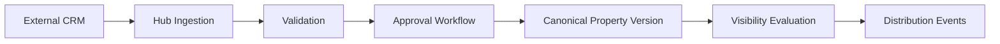

# Ara Strict Mode - GUIDELINES.md Documentation Structure

Current date: May 2026.

Platform: Saudi Arabia Central Real Estate Data Hub. This is a synchronization engine and OAuth 2.1 Provider. Documentation must be structured by domain. Documentation must not become one uncontrolled master file.

This file is the master reference for all future documentation structure and writing rules.

## 1. Purpose

The documentation system must make the project buildable, auditable, and maintainable.

The hub has separate technical domains:

- Product concept.
- Architecture.
- Authentication and authorization.
- Synchronization.
- Visibility.
- Data model.
- Saudi compliance.
- Integrations.
- Developer SDK.
- Frontend.
- Design system.
- Security.
- Operations.
- Testing.
- Tasks and rules.

Each domain must have its own folder.

Each domain folder must have an `index.md`.

No future documentation should be added as a giant root-level document unless it is a short navigation file.

## 2. Target `/docs` Folder Structure

All paths below are under `hub/docs/`.

```txt
docs/
  GUIDELINES.md
  README.md

  product/
    index.md
    vision.md
    scope.md
    glossary.md
    non-goals.md

  architecture/
    index.md
    overview.md
    system-boundaries.md
    backend-architecture.md
    frontend-architecture.md
    folder-structure.md
    data-flow.md
    scalability.md

  auth/
    index.md
    better-auth-setup.md
    oauth-provider.md
    organization-authorization.md
    continue-with-anand.md
    scopes-and-permissions.md
    consent-screen.md
    token-handling.md
    api-keys.md

  synchronization/
    index.md
    sync-engine.md
    inbound-ingestion.md
    approval-flow.md
    canonical-versioning.md
    distribution-events.md
    webhook-delivery.md
    retries-and-dead-letter.md
    conflict-resolution.md
    idempotency.md

  visibility/
    index.md
    visibility-model.md
    marketplace-visibility.md
    crm-visibility.md
    workspace-visibility.md
    legal-government-visibility.md
    partner-visibility.md
    analytics-visibility.md
    suppression-rules.md
    redaction-rules.md

  data-model/
    index.md
    property-model.md
    submission-model.md
    organization-model.md
    integration-model.md
    visibility-model.md
    audit-model.md
    convex-schema.md
    versioning-history.md
    saudi-identifiers.md

  compliance/
    index.md
    saudi-regulatory-context.md
    rega.md
    real-estate-registry.md
    ejar.md
    pdpl.md
    auditability.md
    data-residency.md
    compliance-review-workflow.md

  integrations/
    index.md
    developer-experience.md
    oauth-app-registration.md
    trusted-urls.md
    webhook-contracts.md
    api-contracts.md
    payload-schemas.md
    crm-integration-example.md
    mobile-app-integration-example.md

  sdk/
    index.md
    package-plan.md
    oauth-client.md
    token-management.md
    api-client.md
    webhook-middleware.md
    errors.md
    examples.md

  frontend/
    index.md
    frontend-libraries.md
    app-router-structure.md
    shadcn-usage.md
    forms.md
    data-tables.md
    state-management.md
    realtime-convex.md
    page-specifications.md

  design-system/
    index.md
    brand.md
    colors.md
    typography.md
    spacing.md
    components.md
    data-tables.md
    forms.md
    dark-mode.md
    accessibility.md

  security/
    index.md
    threat-model.md
    authentication-security.md
    token-security.md
    api-key-security.md
    webhook-security.md
    trusted-origin-validation.md
    rate-limiting.md
    ip-blocking.md
    xss-and-injection.md
    secrets-management.md

  convex/
    index.md
    components.md
    better-auth-component.md
    rate-limiter.md
    workpool.md
    workflow.md
    action-retrier.md
    aggregate.md
    migrations.md
    testing.md

  operations/
    index.md
    environments.md
    deployment.md
    monitoring.md
    incident-response.md
    audit-exports.md
    migrations.md
    backup-restore.md

  testing/
    index.md
    test-strategy.md
    unit-tests.md
    integration-tests.md
    contract-tests.md
    authorization-tests.md
    visibility-tests.md
    sync-lifecycle-tests.md
    ui-smoke-tests.md

  project-management/
    index.md
    tasks.md
    rules.md
    implementation-phases.md
    acceptance-criteria.md
```

## 3. Root-Level File Rules

Root-level docs are restricted.

Allowed root-level files:

- `GUIDELINES.md`: master documentation rules.
- `README.md`: documentation navigation entry point.

Temporary root-level files:

- Existing flat files may remain until migrated.
- No new giant root-level specification file is allowed.

Migration candidates from current flat structure:

| Current File | Target Location |
| --- | --- |
| `00-master-specification.md` | Split across all domain folders. Keep only as archive if needed. |
| `01-product-vision.md` | `product/vision.md` |
| `02-system-architecture.md` | `architecture/overview.md` and `architecture/backend-architecture.md` |
| `03-saudi-compliance.md` | `compliance/saudi-regulatory-context.md` |
| `04-data-model.md` | `data-model/convex-schema.md` and related data-model files |
| `05-integration-spec.md` | `integrations/api-contracts.md` and `integrations/webhook-contracts.md` |
| `06-visibility-rules.md` | `visibility/visibility-model.md` and `visibility/suppression-rules.md` |
| `design-system.md` | `design-system/index.md` and split component files |
| `TASKS.md` | `project-management/tasks.md` |
| `RULES.md` | `project-management/rules.md` |
| `CONVEX-COMPONENTS.md` | `convex/components.md` |
| `FRONTEND-LIBRARIES.md` | `frontend/frontend-libraries.md` |
| `AUTH-PROVIDER.md` | `auth/oauth-provider.md` plus related auth files |
| `ARCHITECTURE-OVERVIEW.md` | `architecture/overview.md` |

## 4. Documentation Domains

### 4.1 `product`

Purpose:

- Explain what the hub is.
- Define boundaries.
- Define non-goals.
- Define glossary.

Files:

- `index.md`: domain overview and file list.
- `vision.md`: product vision and central concept.
- `scope.md`: what the hub owns.
- `glossary.md`: canonical terms.
- `non-goals.md`: forbidden scope.

Rules:

- Must state that the hub is a synchronization engine.
- Must state that the hub is not a CRM.
- Must state that the hub is not a marketplace product.

### 4.2 `architecture`

Purpose:

- Explain system architecture.
- Explain boundaries.
- Explain backend and frontend architecture.
- Explain scalability and data flow.

Files:

- `index.md`
- `overview.md`
- `system-boundaries.md`
- `backend-architecture.md`
- `frontend-architecture.md`
- `folder-structure.md`
- `data-flow.md`
- `scalability.md`

Rules:

- Architecture docs must use diagrams where structure is complex.
- Architecture docs must reference source domain docs instead of duplicating entire sections.
- Data flow must be step-by-step.

### 4.3 `auth`

Purpose:

- Document Better Auth.
- Document OAuth 2.1 Provider behavior.
- Document Organization plugin.
- Document "Continue with Anand".
- Document consent, scopes, token handling, and API keys.

Files:

- `index.md`
- `better-auth-setup.md`
- `oauth-provider.md`
- `organization-authorization.md`
- `continue-with-anand.md`
- `scopes-and-permissions.md`
- `consent-screen.md`
- `token-handling.md`
- `api-keys.md`

Rules:

- Must forbid plain Convex Auth.
- Must use Better Auth OAuth 2.1 Provider plugin.
- Must explain organization-level authorization.
- Must separate scopes from permissions.
- Must not place property visibility logic inside auth documentation except by reference.

### 4.4 `synchronization`

Purpose:

- Document the synchronization engine.
- Document inbound claims.
- Document approval.
- Document canonical versions.
- Document distribution events.
- Document retries and dead-letter.

Files:

- `index.md`
- `sync-engine.md`
- `inbound-ingestion.md`
- `approval-flow.md`
- `canonical-versioning.md`
- `distribution-events.md`
- `webhook-delivery.md`
- `retries-and-dead-letter.md`
- `conflict-resolution.md`
- `idempotency.md`

Rules:

- Must state external systems submit claims, not truth.
- Must state approved hub canonical state wins.
- Must include idempotency.
- Must include conflict behavior.

### 4.5 `visibility`

Purpose:

- Document visibility types and decisions.
- Document suppression.
- Document redaction.

Files:

- `index.md`
- `visibility-model.md`
- `marketplace-visibility.md`
- `crm-visibility.md`
- `workspace-visibility.md`
- `legal-government-visibility.md`
- `partner-visibility.md`
- `analytics-visibility.md`
- `suppression-rules.md`
- `redaction-rules.md`

Rules:

- Must treat visibility as computed per property, platform, organization, audience, and channel.
- Must explicitly hide sold/off-market/withdrawn/expired/rejected/suspended marketplace records.
- Must separate CRM visibility from marketplace visibility.
- Must separate Legal/Government visibility from normal partner visibility.

### 4.6 `data-model`

Purpose:

- Document database schema.
- Document entity relationships.
- Document Saudi-specific fields.
- Document versioning and audit relationships.

Files:

- `index.md`
- `property-model.md`
- `submission-model.md`
- `organization-model.md`
- `integration-model.md`
- `visibility-model.md`
- `audit-model.md`
- `convex-schema.md`
- `versioning-history.md`
- `saudi-identifiers.md`

Rules:

- Data model docs must include fields, types, relationships, indexes, and validation notes.
- Data model docs must separate Better Auth component-owned data from hub-owned projection data.

### 4.7 `compliance`

Purpose:

- Document Saudi regulatory context and compliance assumptions.

Files:

- `index.md`
- `saudi-regulatory-context.md`
- `rega.md`
- `real-estate-registry.md`
- `ejar.md`
- `pdpl.md`
- `auditability.md`
- `data-residency.md`
- `compliance-review-workflow.md`

Rules:

- Must cite official sources.
- Must not present technical documentation as legal advice.
- Must mark assumptions.
- Must explain data implications for schema, visibility, audit, and retention.

### 4.8 `integrations`

Purpose:

- Document how external systems connect.

Files:

- `index.md`
- `developer-experience.md`
- `oauth-app-registration.md`
- `trusted-urls.md`
- `webhook-contracts.md`
- `api-contracts.md`
- `payload-schemas.md`
- `crm-integration-example.md`
- `mobile-app-integration-example.md`

Rules:

- Must include payload examples.
- Must include auth headers.
- Must include idempotency.
- Must include webhook signing.
- Must include error examples.

### 4.9 `sdk`

Purpose:

- Document official SDK package.

Files:

- `index.md`
- `package-plan.md`
- `oauth-client.md`
- `token-management.md`
- `api-client.md`
- `webhook-middleware.md`
- `errors.md`
- `examples.md`

Rules:

- SDK docs must separate browser behavior from server behavior.
- SDK docs must never instruct storing client secrets in browser.
- SDK docs must include exact package name when decided.

### 4.10 `frontend`

Purpose:

- Document frontend implementation.

Files:

- `index.md`
- `frontend-libraries.md`
- `app-router-structure.md`
- `shadcn-usage.md`
- `forms.md`
- `data-tables.md`
- `state-management.md`
- `realtime-convex.md`
- `page-specifications.md`

Rules:

- Must use ShadCN/UI primitives.
- Must use Lucide React icons.
- Must not define custom UI primitives unless approved.
- Must explain Convex real-time behavior.

### 4.11 `design-system`

Purpose:

- Document visual and component rules.

Files:

- `index.md`
- `brand.md`
- `colors.md`
- `typography.md`
- `spacing.md`
- `components.md`
- `data-tables.md`
- `forms.md`
- `dark-mode.md`
- `accessibility.md`

Rules:

- Must specify exact tokens.
- Must specify component states.
- Must use ShadCN-compatible patterns.

### 4.12 `security`

Purpose:

- Document threat model and controls.

Files:

- `index.md`
- `threat-model.md`
- `authentication-security.md`
- `token-security.md`
- `api-key-security.md`
- `webhook-security.md`
- `trusted-origin-validation.md`
- `rate-limiting.md`
- `ip-blocking.md`
- `xss-and-injection.md`
- `secrets-management.md`

Rules:

- Must include attack, impact, mitigation.
- Must never include live secrets.
- Must include audit requirements.

### 4.13 `convex`

Purpose:

- Document Convex Components and Convex backend patterns.

Files:

- `index.md`
- `components.md`
- `better-auth-component.md`
- `rate-limiter.md`
- `workpool.md`
- `workflow.md`
- `action-retrier.md`
- `aggregate.md`
- `migrations.md`
- `testing.md`

Rules:

- Must distinguish official Convex Components from community packages.
- Must state when a component is required, conditional, or rejected.

### 4.14 `operations`

Purpose:

- Document operational procedures.

Files:

- `index.md`
- `environments.md`
- `deployment.md`
- `monitoring.md`
- `incident-response.md`
- `audit-exports.md`
- `migrations.md`
- `backup-restore.md`

Rules:

- Must be procedural.
- Must include rollback notes where relevant.
- Must include owner and trigger conditions.

### 4.15 `testing`

Purpose:

- Document test strategy.

Files:

- `index.md`
- `test-strategy.md`
- `unit-tests.md`
- `integration-tests.md`
- `contract-tests.md`
- `authorization-tests.md`
- `visibility-tests.md`
- `sync-lifecycle-tests.md`
- `ui-smoke-tests.md`

Rules:

- Every critical domain must have tests.
- Contract docs must match integration docs.
- Visibility and authorization tests are mandatory.

### 4.16 `project-management`

Purpose:

- Document tasks, rules, phases, and acceptance criteria.

Files:

- `index.md`
- `tasks.md`
- `rules.md`
- `implementation-phases.md`
- `acceptance-criteria.md`

Rules:

- Tasks must be atomic.
- Rules must be mandatory.
- Acceptance criteria must be testable.

## 5. `index.md` Rules

Each domain folder must contain `index.md`.

Required `index.md` structure:

```md
# Domain Name

## Purpose

One paragraph explaining this domain.

## Scope

- What this domain owns.
- What this domain does not own.

## Files

| File | Purpose | Owner |
| --- | --- | --- |
| `file-name.md` | Exact purpose. | Role or domain owner. |

## Read Order

1. `first.md`
2. `second.md`
3. `third.md`

## Related Domains

- `../other-domain/index.md`

## Maintenance Rules

- When to update this domain.
- What not to duplicate.
```

Rules:

- `index.md` must not be a dumping ground.
- `index.md` should route readers to the correct file.
- `index.md` must list every file in its folder.
- If a new file is added, update `index.md` in the same change.

## 6. File Naming Rules

Use lowercase kebab-case.

Allowed:

- `oauth-provider.md`
- `trusted-origin-validation.md`
- `sync-engine.md`
- `marketplace-visibility.md`

Forbidden:

- `OAuthProvider.md`
- `oauthProvider.md`
- `oauth_provider.md`
- `New Document.md`
- `final-v2.md`
- `misc.md`
- `notes.md`

Root files that already exist may remain until migration, but new files must follow this rule.

## 7. File Type Rules

### 7.1 Overview Files

Purpose:

- Explain what the domain is and how its parts fit together.

Rules:

- Keep under 300 lines where possible.
- Link to deeper files.
- Do not duplicate full implementation details.

### 7.2 Implementation Files

Purpose:

- Describe exact implementation steps.

Rules:

- Include file paths.
- Include code examples.
- Include validation rules.
- Include failure states.
- Include tests.

### 7.3 Reference Files

Purpose:

- Store stable lookup information.

Examples:

- Scope list.
- Status list.
- Error code list.
- Field glossary.

Rules:

- Use tables.
- Keep entries precise.
- Avoid narrative.

### 7.4 Policy Files

Purpose:

- Define mandatory rules.

Examples:

- Security policy.
- Visibility policy.
- API key policy.

Rules:

- Use must, must not, required, forbidden.
- Avoid optional language unless optional behavior is real.
- Include enforcement point.

### 7.5 Example Files

Purpose:

- Show concrete external use.

Rules:

- Include complete request/response examples.
- Include headers.
- Include error examples.
- Do not use real secrets or personal data.

## 8. Writing Style and Tone

Writing style:

- Direct.
- Precise.
- Technical.
- No marketing.
- No vague claims.
- No filler.

Use:

- "must" for mandatory rules.
- "must not" for forbidden actions.
- "required" for non-negotiable items.
- "conditional" for optional items with clear trigger.
- "example" only when the content is not normative.

Avoid:

- "maybe".
- "probably".
- "simple".
- "easy".
- "modern".
- "clean".
- "beautiful".
- "elegant".
- "miscellaneous".

## 9. Detail Level Rules

Each document must be as detailed as its risk requires.

High-detail required:

- Authorization.
- OAuth.
- API keys.
- Visibility.
- Synchronization.
- Saudi compliance.
- Data model.
- Security.
- Webhooks.

Medium-detail acceptable:

- Folder overview.
- Product summary.
- Frontend library selection.

Low-detail allowed:

- Index files.
- Navigation files.

Rule:

- If the topic affects data leaving the hub, approval state, security, compliance, or visibility, write high detail.

## 10. Code Example Rules

Code examples must:

- Include file path above the snippet.
- Use TypeScript when relevant.
- Use Zod for validation examples.
- Avoid fake APIs unless marked as pseudocode.
- Avoid secrets.
- Avoid real personal data.
- Be small enough to understand.
- Prefer one responsibility per snippet.

Code examples must not:

- Invent unapproved libraries.
- Store tokens in localStorage without explicit warning.
- Store API keys in plaintext.
- Skip server-side authorization.
- Skip visibility checks.
- Use `any` unless explaining an external unknown payload boundary.

Required code block format:

````md
File: `hub/domains/visibility/evaluate-visibility.ts`

```ts
export function evaluateVisibility(input: VisibilityInput): VisibilityDecision {
  // code
}
```
````

## 11. Diagram Rules

Use diagrams when text alone becomes unclear.

Allowed diagram types:

- Mermaid sequence diagrams.
- Mermaid flowcharts.
- Mermaid entity relationship diagrams.
- Text-based architecture diagrams.

Rules:

- Keep diagrams close to the section they explain.
- Every diagram must have a short explanation.
- Diagrams must not replace written rules.
- Diagrams must use exact domain terms.

Example:



## 12. Reference and Source Rules

Use sources for:

- Saudi regulations.
- REGA.
- Real Estate Registry.
- Ejar.
- PDPL.
- Better Auth.
- Convex Components.
- Next.js.
- ShadCN/UI.
- Security standards.

Rules:

- Prefer official sources.
- Include source links.
- Include access date when the source is regulatory or version-sensitive.
- Do not cite social media for regulatory claims.
- Mark inference separately from sourced fact.

Required source format:

```md
Source: [REGA Real Estate Registry](https://rega.gov.sa/en/rega-services/platforms/real-estate-registry/) accessed May 2026.

Inference: The hub schema must support property number and title deed references because RER records include property identity and ownership deed concepts.
```

## 13. Maintainability Rules

Documentation must not become one massive file.

Rules:

- A file over 500 lines must be reviewed for splitting.
- A file over 800 lines must be split unless it is a temporary archive.
- A section over 150 lines should become its own file.
- Duplicate content must be replaced with links.
- Repeated tables must have one source file.
- Domain docs should link to related domains instead of copying entire sections.

Update rules:

- If code changes behavior, update docs in same change.
- If scopes change, update `auth/scopes-and-permissions.md`.
- If visibility logic changes, update `visibility/`.
- If schema changes, update `data-model/`.
- If integration payload changes, update `integrations/` and `sdk/`.
- If security behavior changes, update `security/`.

## 14. Documentation Review Checklist

Before merging documentation:

- File is in correct domain folder.
- Domain `index.md` is updated.
- File name uses lowercase kebab-case.
- Document states purpose.
- Document states scope.
- Document avoids unrelated features.
- Code examples compile in principle.
- Security examples do not leak secrets.
- Regulatory claims have official sources.
- Cross-domain references are links, not duplicated blocks.
- Required tests or verification steps are listed.
- The file does not become a giant specification.

## 15. Current Migration Plan

Phase 1:

- Create this `GUIDELINES.md`.
- Create `README.md` as docs entry point.
- Create domain folders.
- Add `index.md` to every domain folder.

Phase 2:

- Move existing flat docs into matching domains.
- Split giant files by subject.
- Keep old root files as temporary redirect stubs if needed.

Phase 3:

- Delete or archive obsolete root-level files.
- Enforce new documentation structure in review.

Phase 4:

- Keep documentation updated with implementation changes.

## 16. Final Rule

Every future document must answer:

- What domain owns this?
- What file should contain this?
- What does this document explicitly not own?
- What code or behavior does this affect?
- What other document should be linked instead of duplicated?

If the answer is unclear, create or update the domain `index.md` first.
